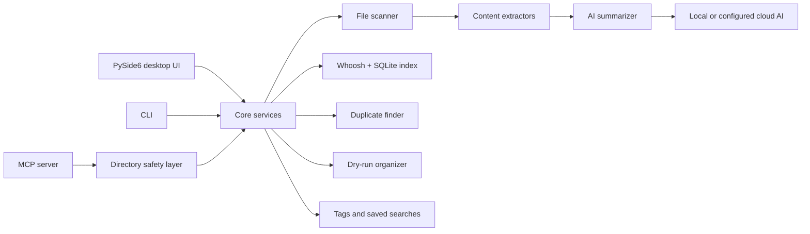

<div align="center">


# FilePilot AI

**Local-first file intelligence for desktop users, CLI workflows, and MCP-enabled AI agents.**

[](https://python.org)
[](https://pypi.org/project/PySide6/)
[](docs/MCP.md)
[](https://whoosh.readthedocs.io/)
[](LICENSE)

Version 0.6.4

</div>

---

## What It Does

FilePilot AI helps you understand, search, summarize, tag, deduplicate, and organize local files before anything gets moved or deleted. It now ships in three layers:

| Layer | Use it for |
| --- | --- |
| Desktop app | Browse, preview, search, tag, summarize, compare, deduplicate, and organize files in a PySide6 UI. |
| CLI | Scan folders, export inventories, find duplicates, analyze disk usage, and preview organization plans from scripts. |
| MCP server | Give Claude Code, Codex, Cursor, and other MCP clients safe, directory-scoped access to FilePilot's local file tools. |

The core promise is local-first behavior. Scanning, indexing, duplicate detection, tags, and organization planning run on your machine. Cloud AI providers are only used when you configure them and explicitly run AI features.

## Why FilePilot MCP

AI coding agents are useful around local files, but unrestricted filesystem access is too risky. FilePilot MCP exposes a safer middle layer:

| Need | FilePilot MCP provides |
| --- | --- |
| Scope control | Directory allowlists with no access outside configured roots. |
| Safe defaults | Read-only mode by default; write operations require `--write`. |
| Bounded reads | File size and returned-character limits for agent-facing reads. |
| Rich extraction | PDF, Word, Excel, PowerPoint, Markdown, code, and plain-text extraction. |
| Cleanup insight | Duplicate detection and dry-run organization plans before action. |

See [docs/MCP.md](docs/MCP.md) for setup, tool details, and client configuration examples.

## Demo

<div align="center">


</div>

## Highlights

- Local full-text search with Whoosh plus SQLite metadata filtering.
- Incremental indexing and optional semantic re-ranking.
- Duplicate detection with size grouping, partial hashing, and full SHA-256 verification.
- Preview-first organization plans by category, date, extension, or size.
- Extractors for PDF, DOCX, XLSX, PPTX, Markdown, code, images, OCR, and plugins.
- Optional AI summaries through local providers or configured cloud providers.
- File tags, saved searches, favorites, tray support, notifications, and plugin registry.
- MCP server for agent workflows with directory-scoped permissions.

## Quick Start

### Desktop App

```bash
git clone https://github.com/cuiheng511/filepilot-ai.git
cd filepilot-ai

python -m venv .venv

# Windows
.venv\Scripts\activate

# macOS / Linux
source .venv/bin/activate

pip install -r requirements.txt
python -m filepilot.main
```

### CLI

```bash
# Scan a folder
python -m filepilot.cli scan ~/Documents

# Search indexed files
python -m filepilot.cli search ~/Documents "machine learning"

# Find duplicate files
python -m filepilot.cli duplicates ~/Downloads

# Export an inventory report
python -m filepilot.cli export ~/Projects --format csv -o report.csv

# Preview an organization plan before moving anything
python -m filepilot.cli organize ~/Downloads ~/Sorted --dry-run --rules category date
```

### MCP Server

Install the optional MCP dependency and start the server with at least one allowed directory:

```bash
pip install -e ".[mcp]"
filepilot-mcp --allow ~/Documents
```

Claude Desktop-style configuration:

```json
{
  "mcpServers": {
    "filepilot": {
      "command": "filepilot-mcp",
      "args": ["--allow", "C:\\Users\\you\\Documents"]
    }
  }
}
```

Write-like tools are disabled unless you opt in:

```bash
filepilot-mcp --allow ~/Documents --write
```

Current MCP tools include `server_status`, `scan_files`, `search_files`, `index_folder`, `search_index`, `read_file`, `extract_file_text`, `summarize_file`, `suggest_tags`, `add_tags`, `find_duplicates`, and `propose_organization_plan`.

## Screenshots

| Dashboard | File Browser |
| --- | --- |
|  |  |

| Search | Tags |
| --- | --- |
|  |  |

| Organize | Duplicates |
| --- | --- |
|  |  |

| AI Summary | Index |
| --- | --- |
|  |  |

## Architecture



## Project Structure

```text
filepilot-ai/
|-- filepilot/
|   |-- ai/                  # AI providers and summarization
|   |-- core/                # Scanner, indexer, organizer, duplicates, tags, operations
|   |-- extractors/          # PDF, Markdown, code, image, Office, OCR extractors
|   |-- mcp/                 # MCP server, tools, and directory-scoped security
|   |-- resources/           # Application icons
|   |-- styles/              # Theme manager and QSS themes
|   |-- ui/                  # PySide6 panels and dialogs
|   |-- cli.py               # Command-line interface
|   `-- main.py              # GUI entry point
|-- tests/                   # Unit and UI tests
|-- scripts/                 # Windows, Linux, and macOS build scripts
|-- docs/                    # MCP, build, AI provider, plugin, and release docs
|-- pyproject.toml           # Package metadata and tooling
`-- requirements.txt         # Runtime dependencies
```

## AI Providers

FilePilot AI supports local and cloud providers through one interface. See [docs/AI-PROVIDERS.md](docs/AI-PROVIDERS.md) for setup details.

| Provider | Mode | Default URL |
| --- | --- | --- |
| Ollama | Local | `http://localhost:11434` |
| llama.cpp / vLLM | Local | `http://localhost:8080` |
| LM Studio | Local | `http://localhost:1234` |
| OpenAI | Cloud | `https://api.openai.com/v1` |
| Anthropic | Cloud | `https://api.anthropic.com` |
| Custom endpoint | Cloud or local | User-defined |

## Security and Privacy

| Area | Design |
| --- | --- |
| Local-first workflow | Scanning, indexing, duplicate detection, tags, and organization run locally. |
| MCP access | Agent access is limited to explicitly allowed directories. |
| MCP writes | Write-like MCP tools are disabled unless the server starts with `--write`. |
| Bounded reads | MCP reads enforce file-size and character limits. |
| Optional AI | Summaries can use local models or explicitly configured cloud providers. |
| API keys | Stored with OS keyring when available, with encrypted fallback storage. |
| Safe deletion | Duplicate cleanup uses the system recycle bin through `send2trash`. |
| Plugin installs | Registry plugin names are constrained, remote entries require SHA-256 pins, and installs require confirmation. |
| Telemetry | No analytics, tracking, or background phone-home behavior. |

## Development

```bash
pip install -e ".[test,dev,mcp]"
ruff check .
ruff format --check .
mypy
python -m pytest
```

For packaging, release integrity, and platform builds, see [docs/BUILD.md](docs/BUILD.md) and [RELEASING.md](RELEASING.md).

## Documentation

| Document | Description |
| --- | --- |
| [docs/MCP.md](docs/MCP.md) | MCP server setup, safety model, tools, and client examples. |
| [docs/AI-PROVIDERS.md](docs/AI-PROVIDERS.md) | Local and cloud AI provider configuration. |
| [docs/BUILD.md](docs/BUILD.md) | Cross-platform packaging guide. |
| [docs/FEATURES.md](docs/FEATURES.md) | Feature notes for newer desktop workflows. |
| [docs/PLUGIN_SDK.md](docs/PLUGIN_SDK.md) | Extractor plugin SDK. |
| [docs/AUTO-UPDATE.md](docs/AUTO-UPDATE.md) | Auto-update API and troubleshooting. |

## Contributing

Contributions are welcome. Please read [CONTRIBUTING.md](CONTRIBUTING.md), keep changes focused, and include tests for behavior changes.

## License

FilePilot AI is released under the [MIT License](LICENSE).
