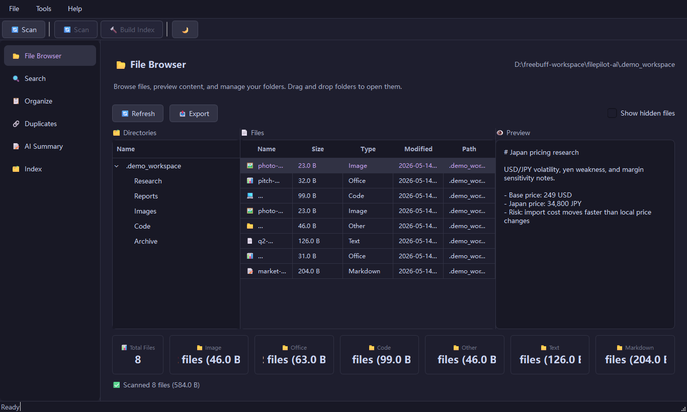
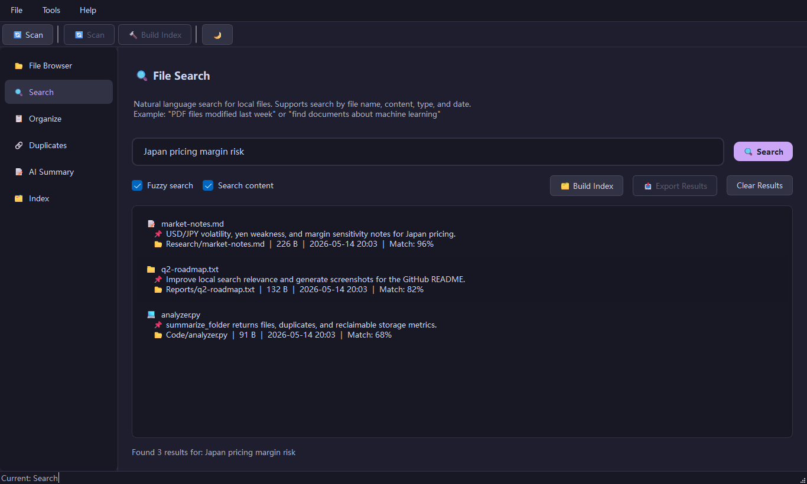
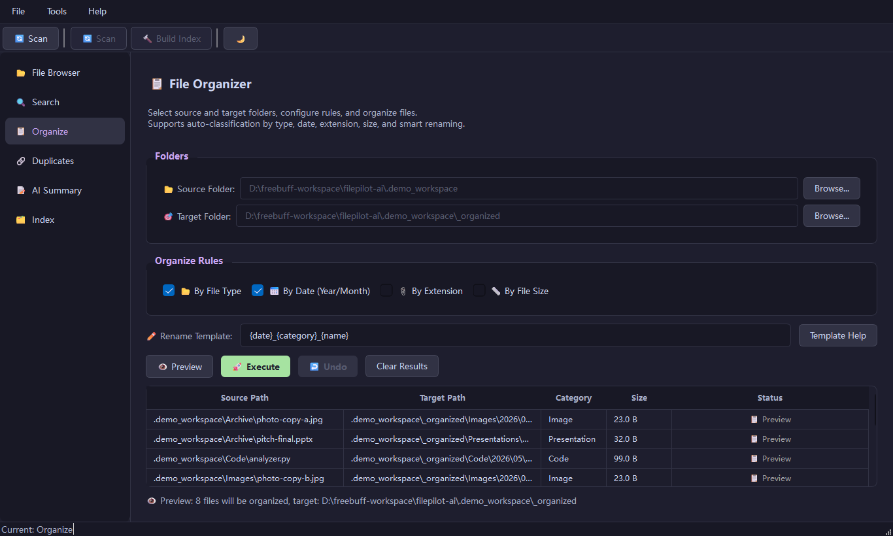
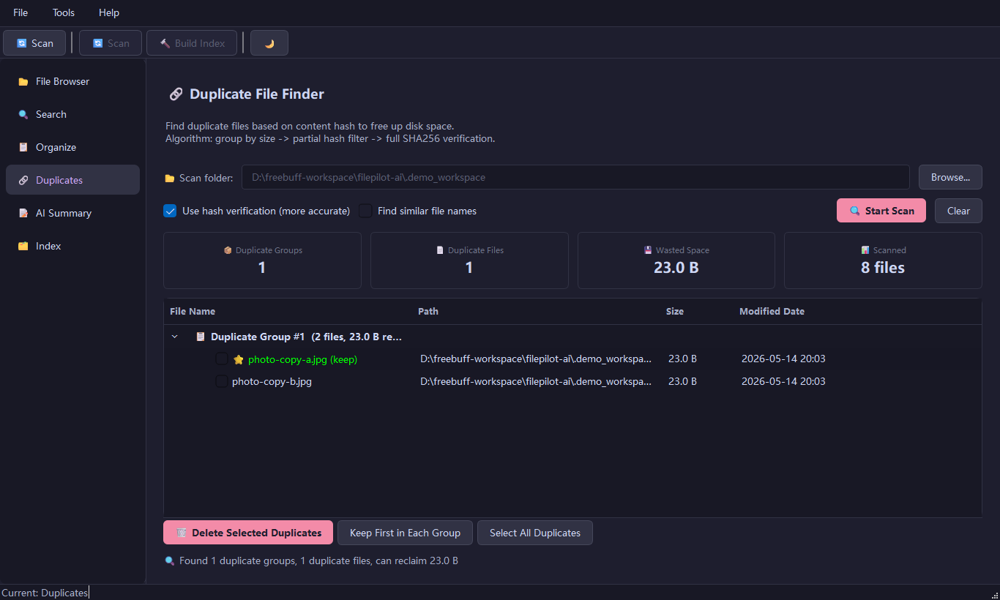
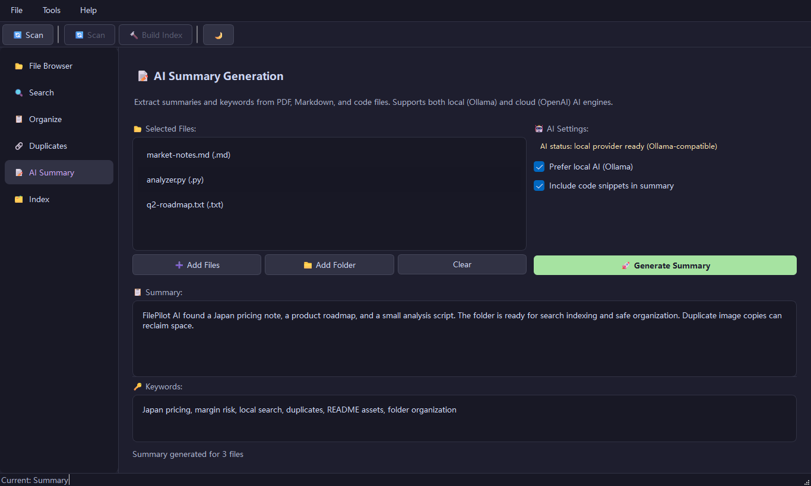
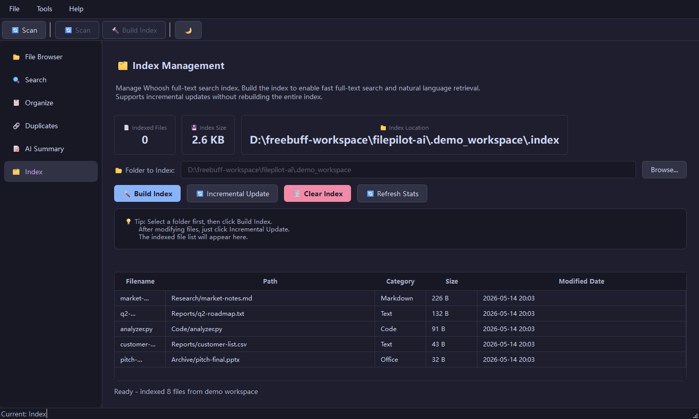
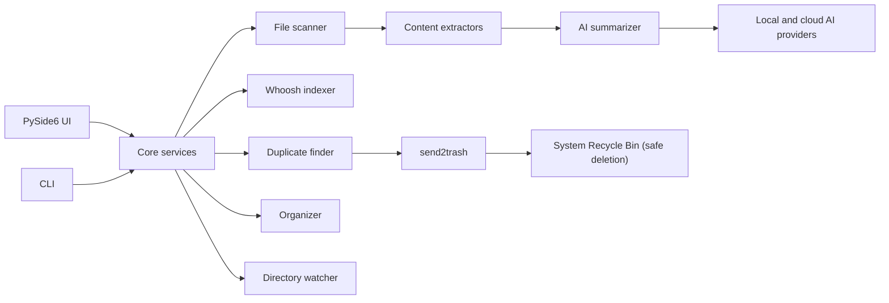

<div align="center">


# FilePilot AI

**A local-first AI file manager for scanning, searching, deduplicating, summarizing, and organizing your files.**

[](https://python.org)
[](https://pypi.org/project/PySide6/)
[](https://whoosh.readthedocs.io/)
[](#security-and-privacy)
[](LICENSE)

Version 0.4.1

</div>

---

## Overview

FilePilot AI is a local-first desktop file manager that helps you inspect, index, search, deduplicate, summarize, and organize your local storage — all through a preview-first workflow.

Your files stay on your machine unless you explicitly choose a cloud AI provider for summarization.

## Demo

<div align="center">


</div>

## Highlights

<table>
<tr>
<td width="33%">

### Smart scanning

- Recursive directory scanning with depth controls
- File type, category, MIME, and hash detection
- Rich metadata: size, date, dimensions, duration
- Respects hidden-file and .gitignore filters

</td>
<td width="33%">

### Fast local search

- Whoosh-powered full-text index
- Keyword, fuzzy, and boolean queries
- Filter by type, date range, and file size
- Export results to CSV

</td>
<td width="33%">

### AI summaries

- Built-in extractors for PDF, Markdown, code, images, DOCX, XLSX, and PPTX
- Local (Ollama, llama.cpp) or cloud AI providers (OpenAI, Anthropic)
- Batch summary workflow for multi-file processing
- Pluggable provider interface with unified API

</td>
</tr>
<tr>
<td width="33%">

### Duplicate cleanup

- Size-bucket grouping for first pass
- Fast partial-hash pre-filter
- Full SHA-256 content verification
- Safe deletion via system Recycle Bin (send2trash)

</td>
<td width="33%">

### Safe organization

- Organize by file type, date, extension, or size range
- Custom rename templates with variables
- Preview changes before applying
- Undo-log support for rollback

</td>
<td width="33%">

### Desktop workflow

- Native PySide6 desktop interface
- Light and dark theme support
- System tray integration with background file watcher
- Toast notifications and 18 UI languages

</td>
</tr>
</table>

## Screenshots

| Browse | Search |
| --- | --- |
|  |  |

| Organize | Duplicates |
| --- | --- |
|  |  |

| AI Summary | Index |
| --- | --- |
|  |  |

## Quick Start

### Requirements

- Python 3.10 or newer
- Windows, macOS, or Linux
- Optional: Ollama, llama.cpp, or LM Studio for local AI
- Optional: OpenAI, Anthropic, or any OpenAI-compatible endpoint for cloud AI

### Install and Run

```bash
git clone https://github.com/cuiheng511/filepilot-ai.git
cd filepilot-ai

python -m venv .venv

# Windows
.venv\Scripts\activate

# macOS / Linux
source .venv/bin/activate

pip install -r requirements.txt
python -m filepilot.main
```

### Development Setup

```bash
pip install -e ".[test,dev]"
pytest
ruff check .
ruff format --check .
mypy
```

## CLI Examples

```bash
# Scan a folder
python -m filepilot.cli scan ~/Documents

# Find duplicate files
python -m filepilot.cli duplicates ~/Downloads

# Export an inventory report
python -m filepilot.cli export ~/Projects --format csv -o report.csv

# Analyze disk usage
python -m filepilot.cli disk-usage ~/

# Search indexed files
python -m filepilot.cli search ~/Documents "machine learning"

# Preview an organization plan before moving anything
python -m filepilot.cli organize ~/Downloads ~/Sorted --dry-run --rules category date
```

## AI Providers

FilePilot AI supports both local and cloud AI providers through a unified interface. See [docs/AI-PROVIDERS.md](docs/AI-PROVIDERS.md) for setup guides, configuration reference, and privacy details for each provider.

| Provider | Mode | Default URL |
| -------- | ---- | ----------- |
| Ollama | Local | `http://localhost:11434` |
| llama.cpp / vLLM | Local | `http://localhost:8080` |
| LM Studio | Local | `http://localhost:1234` |
| OpenAI | Cloud | `https://api.openai.com/v1` |
| Anthropic | Cloud | `https://api.anthropic.com` |
| Custom endpoint | Cloud / Local | User-defined |

Cloud providers only receive the content you choose to summarize. Local scanning, indexing, organization, and duplicate detection do not require AI.

## Project Structure

```text
filepilot-ai/
|-- filepilot/
|   |-- ai/                  # AI providers and summarization
|   |-- core/                # Scanner, indexer, organizer, duplicates, watcher
|   |-- extractors/          # PDF, Markdown, code, image, DOCX, XLSX, PPTX
|   |-- resources/           # Application icons
|   |-- styles/              # Theme manager and QSS themes
|   |-- ui/                  # PySide6 panels, tray, settings, notifications
|   |-- app.py               # Application bootstrap
|   |-- cli.py               # Command-line interface
|   |-- i18n.py              # Translation catalog
|   `-- main.py              # GUI entry point
|-- tests/                   # Unit and UI tests
|-- scripts/                 # Build scripts (Windows/macOS/Linux installers)
|-- .github/workflows/       # CI pipeline (3-platform builds)
|-- FilePilot.spec           # PyInstaller build config (Windows)
|-- pyproject.toml           # Package metadata and tooling
`-- requirements.txt         # Runtime dependencies
```

## Architecture



## Security and Privacy

| Area | Design |
| --- | --- |
| Local-first workflow | File scanning, indexing, duplicate detection, and organization run locally |
| Optional AI | Summarization can use local models or explicit cloud providers |
| Key storage | API keys use OS keyring when available, with encrypted fallback storage |
| Deletion safety | Duplicate removal uses the system recycle bin through `send2trash` |
| Telemetry | No analytics, tracking, or background phone-home behavior |

## Quality Gates

The CI pipeline runs:

- `pytest` — unit and UI tests
- `ruff check .` — linting
- `ruff format --check .` — formatting
- `mypy` — static type checking
- `pip check` — dependency consistency

Run the same checks locally before pushing.

## Build (Cross-Platform)

FilePilot AI is packaged with **PyInstaller** on all three platforms. See [docs/BUILD.md](docs/BUILD.md) for complete build instructions, prerequisites, and troubleshooting.

```bash
# Quick build (auto-detect platform)
./scripts/build.sh
```

### CI Pipeline

The GitHub Actions workflow (`.github/workflows/ci.yml`) automatically builds all three platforms:

| Job | Platform | Runner | Artifact | Retention |
| --- | -------- | ------ | -------- | --------- |
| `build-windows` | Windows | `windows-latest` | `.exe` installer | 30 days |
| `build-linux` | Linux | `ubuntu-latest` | `.AppImage` | 30 days |
| `build-macos` | macOS | `macos-latest` | `.dmg` | 30 days |

Each CI run produces SHA256 checksums alongside the artifacts.

## Auto-Update

FilePilot AI includes a threaded **auto-update checker** that queries GitHub Releases for new versions. See [docs/AUTO-UPDATE.md](docs/AUTO-UPDATE.md) for the full API reference and configuration details.

- Background check every 24 hours (1 hour on failure)
- Results cached to `~/.filepilot/update_check_cache.json`
- Fully thread-safe — runs in a daemon thread

## Documentation

| Guide | Description |
| ----- | ----------- |
| [docs/BUILD.md](docs/BUILD.md) | Cross-platform build and packaging guide |
| [docs/AI-PROVIDERS.md](docs/AI-PROVIDERS.md) | AI provider setup and configuration |
| [docs/AUTO-UPDATE.md](docs/AUTO-UPDATE.md) | Auto-update system API reference |

See [docs/README.md](docs/README.md) for the full documentation index.

## Roadmap

- Application screenshots and demo GIFs
- Summary cache with invalidation
- Large-folder indexing performance tuning
- More organization templates
- More end-to-end packaging tests

## Contributing

Contributions are welcome. See [CONTRIBUTING.md](CONTRIBUTING.md) for environment setup, style rules, and pull request guidance.

## License

FilePilot AI is released under the [MIT License](LICENSE).
