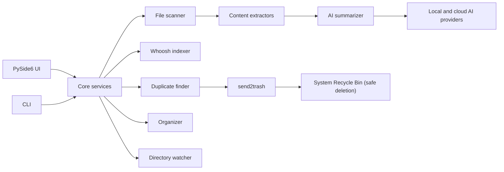

<div align="center">


# FilePilot AI

**A local-first AI file manager for scanning, searching, deduplicating, summarizing, and organizing your files.**

[](https://python.org)
[](https://pypi.org/project/PySide6/)
[](https://whoosh.readthedocs.io/)
[](#security-and-privacy)
[](LICENSE)

Version 0.4.0

</div>

---

## Overview

FilePilot AI is a desktop assistant for people who live inside large folders. It helps you inspect local storage, build a searchable file index, detect duplicate content, generate AI summaries, and reorganize messy directories with a preview-first workflow.

The app is designed around one principle: your files stay on your machine unless you explicitly choose a cloud AI provider for summarization.

## Demo

<div align="center">


</div>

## Highlights

<table>
<tr>
<td width="33%">

### Smart scanning

- Recursive directory scanning
- File type and category detection
- Size, date, MIME, and hash metadata
- Hidden-file and depth controls

</td>
<td width="33%">

### Fast local search

- Whoosh full-text index
- Keyword and fuzzy matching
- Type, date, and size filters
- Exportable search results

</td>
<td width="33%">

### AI summaries

- PDF, Markdown, code, image, DOCX, XLSX, and PPTX extractors
- Local or cloud AI providers
- Batch-friendly summary workflow
- Unified provider interface

</td>
</tr>
<tr>
<td width="33%">

### Duplicate cleanup

- Size grouping
- Partial hash pre-check
- Full SHA256 verification
- Recycle-bin based deletion

</td>
<td width="33%">

### Safe organization

- Organize by type, date, extension, and size
- Rename templates
- Preview before moving
- Undo log support

</td>
<td width="33%">

### Desktop workflow

- PySide6 native interface
- Light and dark themes
- Tray and background watcher
- Toast notifications and 18 UI languages

</td>
</tr>
</table>

## Screenshots

| Browse | Search |
| --- | --- |
|  |  |

| Organize | Duplicates |
| --- | --- |
|  |  |

| AI Summary | Index |
| --- | --- |
|  |  |

## Icon

The application icon lives in:

- `filepilot/resources/app.png`
- `filepilot/resources/app.ico`

The current icon uses a folder, document, and connected AI nodes to make the product signal clear at small desktop sizes.

## Quick Start

### Requirements

- Python 3.10 or newer
- Windows, macOS, or Linux
- Optional: Ollama, llama.cpp, or LM Studio for local AI
- Optional: OpenAI, Anthropic, or any OpenAI-compatible endpoint for cloud AI

### Install and Run

```bash
git clone https://github.com/cuiheng511/filepilot-ai.git
cd filepilot-ai

python -m venv .venv

# Windows
.venv\Scripts\activate

# macOS / Linux
source .venv/bin/activate

pip install -r requirements.txt
python -m filepilot.main
```

### Development Setup

```bash
pip install -e ".[test,dev]"
pytest
ruff check .
ruff format --check .
mypy
```

## CLI Examples

```bash
# Scan a folder
python -m filepilot.cli scan ~/Documents

# Find duplicate files
python -m filepilot.cli duplicates ~/Downloads

# Export an inventory report
python -m filepilot.cli export ~/Projects --format csv -o report.csv

# Analyze disk usage
python -m filepilot.cli disk-usage ~/

# Search indexed files
python -m filepilot.cli search ~/Documents "machine learning"

# Preview an organization plan before moving anything
python -m filepilot.cli organize ~/Downloads ~/Sorted --dry-run --rules category date
```

## AI Providers

| Provider | Mode | Notes |
| --- | --- | --- |
| Ollama | Local | Good default for private summaries on your own machine |
| llama.cpp / LM Studio | Local | Works with compatible local HTTP servers |
| OpenAI | Cloud | Uses OpenAI-compatible chat completions |
| Anthropic | Cloud | Claude provider support |
| Custom endpoint | Cloud or local | Supports OpenAI-compatible APIs such as self-hosted gateways |

Cloud providers only receive the content you choose to summarize. Local scanning, indexing, organization, and duplicate detection do not require AI.

## Project Structure

```text
filepilot-ai/
|-- filepilot/
|   |-- ai/                  # AI providers and summarization
|   |-- core/                # Scanner, indexer, organizer, duplicates, watcher
|   |-- extractors/          # PDF, Markdown, code, image, DOCX, XLSX, PPTX
|   |-- resources/           # Application icons
|   |-- styles/              # Theme manager and QSS themes
|   |-- ui/                  # PySide6 panels, tray, settings, notifications
|   |-- app.py               # Application bootstrap
|   |-- cli.py               # Command-line interface
|   |-- i18n.py              # Translation catalog
|   `-- main.py              # GUI entry point
|-- tests/                   # Unit and UI tests
|-- scripts/                 # Build scripts (Windows/macOS/Linux installers)
|-- .github/workflows/       # CI pipeline (3-platform builds)
|-- FilePilot.spec           # PyInstaller build config (Windows)
|-- pyproject.toml           # Package metadata and tooling
`-- requirements.txt         # Runtime dependencies
```

## Architecture



## Security and Privacy

| Area | Design |
| --- | --- |
| Local-first workflow | File scanning, indexing, duplicate detection, and organization run locally |
| Optional AI | Summarization can use local models or explicit cloud providers |
| Key storage | API keys use OS keyring when available, with encrypted fallback storage |
| Deletion safety | Duplicate removal uses the system recycle bin through `send2trash` |
| Telemetry | No analytics, tracking, or background phone-home behavior |

## Quality Gates

The CI pipeline runs:

- `pytest` — unit and UI tests
- `ruff check .` — linting
- `ruff format --check .` — formatting
- `mypy` — static type checking (Windows / Linux / macOS build)
- `pip check` — dependency consistency (Windows / Linux / macOS build)

Recommended for local development: none beyond what runs in CI

## Build (Cross-Platform)

FilePilot AI supports three packaging targets, all managed by a unified entry point:

```bash
# Auto-detect current platform and build
./scripts/build.sh

# Or build for a specific platform:
./scripts/build_appimage.sh          # Linux AppImage
./scripts/build_macos.sh --sign      # macOS .app + .dmg
./scripts/build.sh --docker-linux    # Linux AppImage via Docker (any OS)
.\scripts\build_installer.ps1        # Windows installer (Inno Setup)
```

### Windows Installer

- Built with **PyInstaller** + **Inno Setup 6**
- Output: `dist/FilePilot-AI-Setup-{version}.exe`
- Installs to `Program Files\FilePilot AI`, Start Menu & Desktop shortcuts
- Uninstaller via Control Panel
- English-only installer
  > To add Chinese Simplified:
  > 1. Download `ChineseSimplified.isl` from [jrsoftware.org](https://jrsoftware.org/isdl.php)
  > 2. Place it in Inno Setup's `Languages` directory
  > 3. In `filepilot-installer.iss`, add the following line after the existing `english` entry:
  >    `Name: "chinesesimplified"; MessagesFile: "compiler:Languages\ChineseSimplified.isl"`


- Optional: Authenticode digital signing (set `SIGNTOOL_PATH` + `SIGN_CERTIFICATE_SHA1`)

### Linux AppImage

- Built with **PyInstaller** + **appimagetool**
- Output: `dist/FilePilot-{version}-x86_64.AppImage`
- Bundles `.desktop` file, AppStream metainfo, and application icons
- Portable — no installation required, runs on any Linux distribution

### macOS .app + .dmg

- Built with **PyInstaller** + **create-dmg**
- Output: `dist/FilePilot-{version}.dmg`
- Native `.app` bundle with `.icns` icon
- Optional: Code signing via `--sign` flag (Apple Developer ID)
- Optional: Notarization via `--notarize` (Apple Notary Service)

### CI Pipeline

The GitHub Actions workflow (`.github/workflows/ci.yml`) automatically builds all three platforms:

| Job | Platform | Runner | Artifact | Retention |
| --- | -------- | ------ | -------- | --------- |
| `build-windows` | Windows | `windows-latest` | `.exe` installer | 30 days |
| `build-linux` | Linux | `ubuntu-latest` | `.AppImage` | 30 days |
| `build-macos` | macOS | `macos-latest` | `.dmg` | 30 days |

Each CI run produces SHA256 checksums alongside the artifacts.

## Auto-Update

FilePilot AI includes a built-in **auto-update checker** that queries GitHub Releases:

```python
from filepilot.updater import UpdateChecker, check_now

# Background check with callback
checker = UpdateChecker()
checker.check_async(callback=on_result)

# Synchronous check
result = check_now()
if result.has_update:
    print(f"Update available: {result.release.version}")
    checker.open_download_page()
```

- Checks every 24 hours (1 hour on failure)
- Results cached locally to avoid unnecessary API calls
- Thread-safe: runs in background daemon thread

## Roadmap

- Application screenshots and demo GIFs
- Summary cache with invalidation
- Large-folder indexing performance tuning
- More organization templates
- More end-to-end packaging tests

## Contributing

Contributions are welcome. See [CONTRIBUTING.md](CONTRIBUTING.md) for environment setup, style rules, and pull request guidance.

## License

FilePilot AI is released under the [MIT License](LICENSE).
