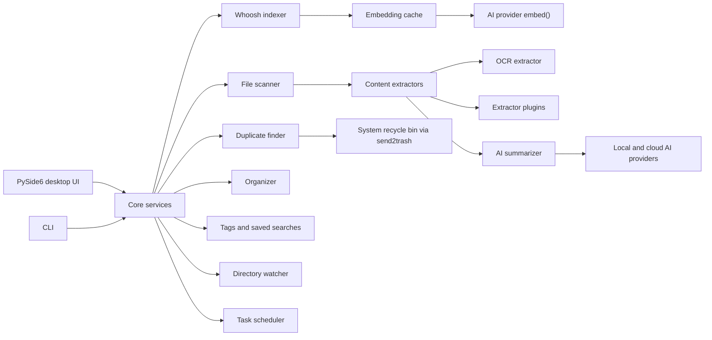

<div align="center">


# FilePilot AI

**A local-first AI file manager for search, tags, OCR, duplicates, summaries, and safer file organization.**

[](https://python.org)
[](https://pypi.org/project/PySide6/)
[](https://whoosh.readthedocs.io/)
[](#security-and-privacy)
[](LICENSE)

Version 0.6.2

</div>

---

## Why FilePilot AI

FilePilot AI helps you understand a messy local folder before you move, delete, rename, tag, summarize, or archive anything. It combines a desktop file browser, full-text indexing, duplicate detection, OCR, tagging, saved searches, semantic search, and optional AI summaries in one PySide6 app.

Scanning, indexing, tags, duplicate detection, and organization stay local by default. Cloud AI providers are only used when you configure them and explicitly run AI features.

## Demo

<div align="center">


</div>

## What's New in 0.6.2

| Area | Update |
| --- | --- |
| Semantic search | Embedding-based re-ranking of Whoosh results using AI provider `embed()` — cosine similarity (pure Python), cached in `~/.filepilot/embeddings.json`. Toggle via "🔬 Semantic" checkbox. |
| i18n completeness | 160 missing keys added across 16 non-en/zh languages; ~40 previously hardcoded UI strings now use `t()`. Remaining ~180 strings also wired (this release). |
| Bug fixes | Embedding provider now cached (not re-created per-file). Embeddings persisted via `save()` after indexing. Search cache skips semantic results (scores change over time). Anthropic correctly returns `None` for `embed()`. |
| Quality | 737 tests passing (18 new embedding tests), ruff/mypy clean. |

### What was new in 0.6.1

| Area | Update |
| --- | --- |
| Type annotations | 17 `annotation-unchecked` mypy warnings resolved across 8 source files. |
| Test expansion | 7 new test files: event_bus, app_state, tag_rules, notification, directory_tree, tags_panel, plugin_manager_panel. Total: 745 tests. |
| Batch operations | Right-click context menu on search results with multi-select: delete, move, copy, tag, open location. Undo log for moves. |
| Auto-update | Streaming download with progress, platform-specific installer launch. New "🔄 Updates" tab in Settings. |
| System tray | Minimize-to-tray, close-to-tray, three-platform auto-start (Windows/Linux/macOS). |
| UI stuck fixes | Scan exception restores UI, large-file preview streams, zero-division guard in rename, progress bar reaches 100%. |

## Screenshots

| Dashboard | File Browser |
| --- | --- |
|  |  |

| Search | Tags |
| --- | --- |
|  |  |

| Organize | Duplicates |
| --- | --- |
|  |  |

| AI Summary | Index |
| --- | --- |
|  |  |

| Plugin Manager |
| --- |
|  |

## Features

### Search and Indexing

- Whoosh-powered local full-text index.
- Keyword, fuzzy, boolean, tag-filtered, saved, and semantic search.
- Search history, CSV export, and incremental index updates.
- Embedding cache for semantic re-ranking without adding a heavy numeric dependency.

### File Management

- Preview-first file browser with custom columns and archive browsing.
- Batch copy, move, delete, tag, rename, and open-location actions.
- Favorites, recent folders, recent files, global shortcuts, themes, tray support, and notifications.
- 18 built-in UI languages.

### Organization and Cleanup

- Organize files by type, date, extension, or size range.
- Batch rename with templates, regex support, and preview before execution.
- Duplicate detection with size grouping, partial hashing, full SHA-256 verification, and safe deletion through the system recycle bin.
- Undo-log support for organization workflows.

### AI, OCR, and Extractors

- Optional AI summaries and keyword extraction for PDF, Markdown, code, text, Office files, and images.
- OCR support through Tesseract for image text extraction.
- Local providers: Ollama, llama.cpp, LM Studio, or OpenAI-compatible local endpoints.
- Cloud providers: OpenAI, Anthropic, and custom OpenAI-compatible APIs.
- Plugin system for custom content extractors.

## Quick Start

### Requirements

- Python 3.10 or newer
- Windows, macOS, or Linux
- Optional: Ollama, llama.cpp, LM Studio, or another local AI runtime
- Optional: OpenAI, Anthropic, or any OpenAI-compatible endpoint
- Optional: Tesseract OCR for image text extraction

### Run from Source

```bash
git clone https://github.com/cuiheng511/filepilot-ai.git
cd filepilot-ai

python -m venv .venv

# Windows
.venv\Scripts\activate

# macOS / Linux
source .venv/bin/activate

pip install -r requirements.txt
python -m filepilot.main
```

### Development Setup

```bash
pip install -e ".[test,dev]"
ruff check .
ruff format --check .
mypy
pytest
```

## CLI Examples

```bash
# Scan a folder
python -m filepilot.cli scan ~/Documents

# Search indexed files
python -m filepilot.cli search ~/Documents "machine learning"

# Find duplicate files
python -m filepilot.cli duplicates ~/Downloads

# Export an inventory report
python -m filepilot.cli export ~/Projects --format csv -o report.csv

# Analyze disk usage
python -m filepilot.cli disk-usage ~/

# Preview an organization plan before moving anything
python -m filepilot.cli organize ~/Downloads ~/Sorted --dry-run --rules category date
```

## AI Providers

FilePilot AI supports local and cloud providers through a unified interface. See [docs/AI-PROVIDERS.md](docs/AI-PROVIDERS.md) for setup details, examples, and provider-specific privacy notes.

| Provider | Mode | Default URL |
| --- | --- | --- |
| Ollama | Local | `http://localhost:11434` |
| llama.cpp / vLLM | Local | `http://localhost:8080` |
| LM Studio | Local | `http://localhost:1234` |
| OpenAI | Cloud | `https://api.openai.com/v1` |
| Anthropic | Cloud | `https://api.anthropic.com` |
| Custom endpoint | Cloud or local | User-defined |

Cloud providers only receive content you choose to summarize. Routine scanning, indexing, tagging, searching, duplicate detection, and organization do not require cloud AI.

## Architecture



## Project Structure

```text
filepilot-ai/
|-- filepilot/
|   |-- ai/                  # AI providers and summarization
|   |-- core/                # Scanner, indexer, organizer, duplicates, tags, watcher
|   |-- extractors/          # PDF, Markdown, code, image, Office, OCR extractors
|   |-- resources/           # Application icons
|   |-- styles/              # Theme manager and QSS themes
|   |-- ui/                  # PySide6 panels and dialogs
|   |-- app.py               # Application bootstrap
|   |-- auto_start.py        # OS startup registration
|   |-- cli.py               # Command-line interface
|   |-- i18n.py              # Translation catalog
|   `-- main.py              # GUI entry point
|-- tests/                   # Unit and UI tests
|-- scripts/                 # Windows, Linux, and macOS build scripts
|-- docs/                    # Build, AI provider, and asset docs
|-- .github/workflows/       # CI pipeline
|-- FilePilot.spec           # Windows PyInstaller build config
|-- pyproject.toml           # Package metadata and tooling
`-- requirements.txt         # Runtime dependencies
```

## Build Installers

For full build instructions, see [docs/BUILD.md](docs/BUILD.md).

| Platform | Output |
| --- | --- |
| Windows | `dist/FilePilot/` and `dist/FilePilot-AI-Setup-*.exe` |
| Linux | `FilePilot-AI-*.AppImage` |
| macOS | `FilePilot AI.app` and `FilePilot-AI-*.dmg` |

## Security and Privacy

| Area | Design |
| --- | --- |
| Local-first workflow | File scanning, indexing, duplicate detection, tags, and organization run locally. |
| Optional AI | Summarization can use local models or explicitly configured cloud providers. |
| API keys | Stored with OS keyring when available, with encrypted fallback storage. |
| Safe deletion | Duplicate cleanup uses the system recycle bin through `send2trash`. |
| Telemetry | No analytics, tracking, or background phone-home behavior. |

## Quality Gates

```bash
ruff check .
ruff format --check .
mypy
pytest
```

The CI pipeline runs linting, type checking, tests, coverage upload, and packaged builds for Windows, Linux, and macOS.

## Contributing

Contributions are welcome. Please read [CONTRIBUTING.md](CONTRIBUTING.md), keep changes focused, and include tests for behavior changes.

## License

FilePilot AI is released under the [MIT License](LICENSE).
