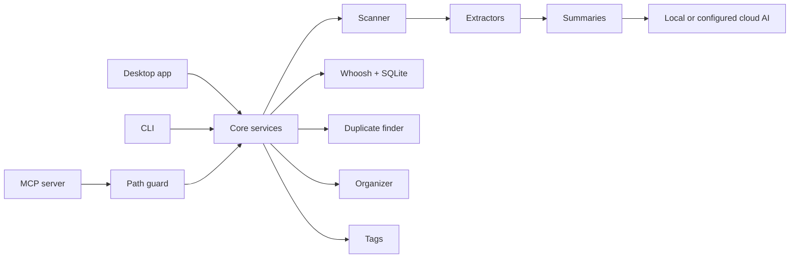

<div align="center">


# FilePilot AI

**Local-first file intelligence for desktop users, scripts, and AI coding agents.**

FilePilot AI helps you search, understand, tag, deduplicate, summarize, and safely organize local files. It now includes a desktop app, a CLI, and an MCP server for Claude Code, Codex, Cursor, and other agent clients.

[](https://python.org)
[](https://pypi.org/project/PySide6/)
[](docs/MCP.md)
[](https://whoosh.readthedocs.io/)
[](LICENSE)

Version 0.7.0

</div>

---

## Why FilePilot Exists

Modern AI agents can reason about code and documents, but giving them raw access to your whole filesystem is risky. FilePilot sits between your local files and the tools that need them.

It is built around a simple promise:

- Your files stay local by default.
- File reads are scoped, bounded, and explicit.
- Cleanup starts as a preview, not a destructive action.
- AI features are optional and use only the providers you configure.
- Agent-facing write operations require opt-in write mode, confirmation, validation, and audit logs.

## Three Ways To Use It

| Layer | Best for | Entry point |
| --- | --- | --- |
| Desktop app | Visual browsing, previews, search, tags, summaries, duplicate review, and organization planning. | `python -m filepilot.main` |
| CLI | Repeatable scripts for scanning, searching, exports, disk usage, duplicates, and dry-run organization. | `python -m filepilot.cli` |
| MCP server | Safe local file tools for Claude Code, Codex, Cursor, Claude Desktop, and other MCP clients. | `filepilot-mcp` |

## MCP For AI Agents

FilePilot MCP is the most agent-ready part of the project. It exposes useful file operations without handing an agent unrestricted filesystem access.

| Safety concern | FilePilot MCP behavior |
| --- | --- |
| Filesystem scope | Only directories passed with `--allow` are accessible. |
| Default permissions | The server starts read-only. Write-like tools require `--write`. |
| Large or sensitive reads | File size and returned-character limits are enforced. |
| Hidden paths | Dot-prefixed hidden paths are blocked unless `--allow-hidden` is set. |
| Organization changes | Plans are dry-run first, saved by ID, discoverable/filterable, then applied only with `confirm=True`. |
| Auditability | Write-like operations are recorded as JSONL audit events. |

Current MCP tools:

```text
server_status, scan_files, search_files, index_folder, search_index,
read_file, extract_file_text, summarize_file, suggest_tags, add_tags,
find_duplicates, propose_organization_plan, list_plans,
cleanup_plans, apply_organization_plan, undo_organization_plan
```

See [docs/MCP.md](docs/MCP.md) for the full safety model, [docs/MCP-CLIENTS.md](docs/MCP-CLIENTS.md) for Claude Desktop, Claude Code, Cursor, and Codex snippets, and [docs/ARCHITECTURE.md](docs/ARCHITECTURE.md) for the project architecture.

## Quick Start

### Desktop App

```bash
git clone https://github.com/cuiheng511/filepilot-ai.git
cd filepilot-ai

python -m venv .venv

# Windows
.venv\Scripts\activate

# macOS / Linux
source .venv/bin/activate

pip install -r requirements.txt
python -m filepilot.main
```

Package installs can choose only the needed layer:

```bash
pip install "filepilot-ai[desktop]"
pip install "filepilot-ai[mcp]"
```

### MCP Server

Install the MCP extra and allow one local folder:

```bash
pip install -e ".[mcp]"
filepilot-mcp --allow ~/Documents --read-only
```

Allow multiple roots when a task needs both source and target folders:

```bash
filepilot-mcp --allow ~/Downloads --allow ~/Sorted --read-only
```

Enable write-like tools only for trusted sessions:

```bash
filepilot-mcp --allow ~/Downloads --allow ~/Sorted --write
```

Minimal MCP client config:

```json
{
  "mcpServers": {
    "filepilot": {
      "command": "filepilot-mcp",
      "args": ["--allow", "C:\\Users\\you\\Documents", "--read-only"]
    }
  }
}
```

### CLI

```bash
# Scan a folder
python -m filepilot.cli scan ~/Documents

# Search indexed files
python -m filepilot.cli search ~/Documents "project notes"

# Find duplicate files
python -m filepilot.cli duplicates ~/Downloads

# Export an inventory report
python -m filepilot.cli export ~/Projects --format csv -o report.csv

# Preview an organization plan before moving anything
python -m filepilot.cli organize ~/Downloads ~/Sorted --dry-run --rules category date
```

## What FilePilot Can Do

| Area | Capabilities |
| --- | --- |
| Search and indexing | Local full-text search with Whoosh, SQLite metadata filtering, incremental indexing, and optional semantic re-ranking. |
| File understanding | Text extraction for PDF, DOCX, XLSX, PPTX, Markdown, code, and plain text, with optional summaries. |
| Organization | Preview-first organization by category, date, extension, or size, plus safer move/undo flows. |
| Duplicate cleanup | Duplicate grouping with size checks, partial hashing, and full SHA-256 verification. |
| Tags and memory | File tags, saved searches, favorites, tag cloud, and tag automation rules. |
| Desktop workflows | File browser, previews, AI chat panel, notifications, tray support, themes, and accessibility labels. |
| Product guidance | First-run onboarding, dashboard workspace status, and a settings view for security and privacy boundaries. |
| Extensibility | Extractor plugin SDK and plugin registry with safer remote-plugin checks. |
| Agent workflows | Directory-scoped MCP tools with read limits, discoverable saved plans, write opt-in, apply/undo planning, and audit logs. |

## Screenshots

| Dashboard | File Browser |
| --- | --- |
|  |  |

| Search | Tags |
| --- | --- |
|  |  |

| Organize | Duplicates |
| --- | --- |
|  |  |

| AI Summary | Index |
| --- | --- |
|  |  |

## Architecture



```text
filepilot-ai/
|-- filepilot/
|   |-- ai/                  # AI providers and summarization
|   |-- core/                # Scanner, indexer, organizer, duplicates, tags, operations
|   |-- extractors/          # PDF, Markdown, code, image, Office, OCR extractors
|   |-- mcp/                 # MCP server, tools, audit log, and path safety
|   |-- ui/                  # PySide6 panels and dialogs
|   |-- cli.py               # Command-line interface
|   `-- main.py              # GUI entry point
|-- docs/                    # MCP, build, AI provider, plugin, and release docs
|-- tests/                   # Unit and UI tests
|-- scripts/                 # Build and release helpers
`-- pyproject.toml           # Package metadata and tooling
```

## AI Providers

AI is optional. FilePilot works locally for scanning, indexing, duplicates, tags, and organization planning. When summaries or open-ended chat need a model, FilePilot can use configured local or cloud providers.

| Provider | Mode | Default URL |
| --- | --- | --- |
| Ollama | Local | `http://localhost:11434` |
| llama.cpp / vLLM | Local | `http://localhost:8080` |
| LM Studio | Local | `http://localhost:1234` |
| OpenAI | Cloud | `https://api.openai.com/v1` |
| Anthropic | Cloud | `https://api.anthropic.com` |
| Custom endpoint | Cloud or local | User-defined |

See [docs/AI-PROVIDERS.md](docs/AI-PROVIDERS.md) for setup details.

## Security And Privacy

| Area | Design |
| --- | --- |
| Local-first workflow | Scanning, indexing, duplicate detection, tags, and organization planning run locally. |
| MCP access | Agent access is limited to explicitly allowed directories. |
| MCP writes | Write-like tools are disabled unless the server starts with `--write`. |
| MCP audit log | Write-like MCP operations are recorded as JSONL audit events. |
| Organization apply/undo | Saved organization plans require `--write`, `confirm=True`, and current allowlist validation before any move or restore. |
| Bounded reads | MCP reads enforce file-size and character limits. |
| Optional AI | Summaries can use local models or explicitly configured cloud providers. |
| API keys | Stored with OS keyring when available, with encrypted fallback storage. |
| Safe deletion | Duplicate cleanup uses the system recycle bin through `send2trash`. |
| Plugin installs | Registry plugin names are constrained, remote entries require SHA-256 pins, and installs require confirmation. |
| Telemetry | No analytics, tracking, or background phone-home behavior. |

## Development

```bash
pip install -e ".[test,dev,desktop,mcp]"
ruff check .
ruff format --check .
mypy
python -m pytest
```

The current test suite covers core services, UI behavior, CLI flows, MCP security, MCP tools, and release helpers.

## Documentation

| Document | Description |
| --- | --- |
| [docs/MCP.md](docs/MCP.md) | MCP server setup, safety model, tools, and troubleshooting. |
| [docs/MCP-CLIENTS.md](docs/MCP-CLIENTS.md) | Client snippets for Claude Desktop, Claude Code, Cursor, and Codex. |
| [docs/ARCHITECTURE.md](docs/ARCHITECTURE.md) | System map, data flow, core services, MCP safety boundary, and extension points. |
| [docs/ROADMAP.md](docs/ROADMAP.md) | Near-term quality track, 0.7.x polish, 0.8 MCP productization, larger refactors, and contribution ideas. |
| [docs/USE-CASES.md](docs/USE-CASES.md) | Practical workflows for Downloads triage, duplicates, summaries, MCP agents, maintenance, and plugins. |
| [docs/AI-PROVIDERS.md](docs/AI-PROVIDERS.md) | Local and cloud AI provider configuration. |
| [docs/FEATURES.md](docs/FEATURES.md) | Practical notes for newer desktop workflows. |
| [docs/PLUGIN_SDK.md](docs/PLUGIN_SDK.md) | Extractor plugin SDK and plugin examples. |
| [docs/BUILD.md](docs/BUILD.md) | Cross-platform packaging guide. |
| [docs/AUTO-UPDATE.md](docs/AUTO-UPDATE.md) | Auto-update API and troubleshooting. |
| [RELEASING.md](RELEASING.md) | Release process and integrity checks. |

## Contributing

Contributions are welcome. Please read [CONTRIBUTING.md](CONTRIBUTING.md), keep changes focused, and include tests for behavior changes.

## License

FilePilot AI is released under the [MIT License](LICENSE).
