<div align="center">


# FilePilot AI

**A local-first AI file manager for search, tags, OCR, duplicates, summaries, and safer file organization.**

[](https://python.org)
[](https://pypi.org/project/PySide6/)
[](https://whoosh.readthedocs.io/)
[](#security-and-privacy)
[](LICENSE)

Version 0.6.4

</div>

---

## Why FilePilot AI

FilePilot AI helps you understand a messy local folder before you move, delete, rename, tag, summarize, or archive anything. It combines a desktop file browser, full-text indexing, duplicate detection, OCR, tagging, saved searches, semantic search, and optional AI summaries in one PySide6 app.

Scanning, indexing, tags, duplicate detection, and organization stay local by default. Cloud AI providers are only used when you configure them and explicitly run AI features.

## Highlights

| Need | FilePilot AI helps with |
| --- | --- |
| Find files | Local full-text search, fuzzy search, saved searches, semantic re-ranking, and tag filters. |
| Understand files | Preview, OCR, extractors, optional AI summaries, and an AI chat panel for natural-language file questions. |
| Clean up safely | Duplicate detection, recycle-bin deletion, shared conflict-safe file operations, and previewable organization plans. |
| Extend workflows | Community extractor plugins, task scheduling, tray support, and cross-platform installer builds. |

## Demo

<div align="center">

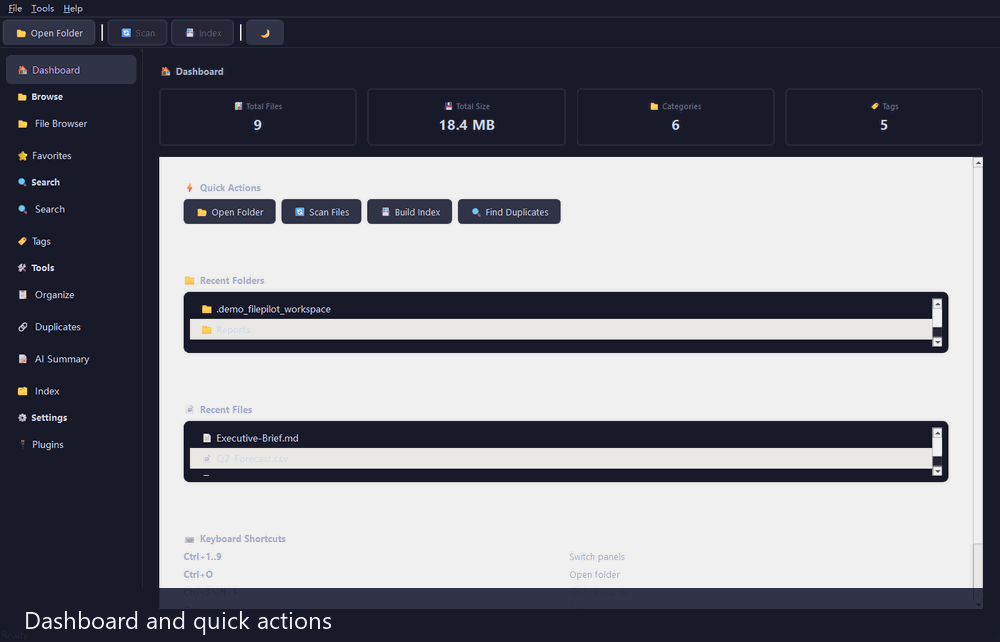

</div>

## What's New in 0.6.4

| Area | Update |
| --- | --- |
| AI Chat panel | Conversational file assistant — ask "Find large PDFs", "How many Python files?" in natural language. Uses local intent parsing (no AI needed for simple queries) or optional AI provider for smarter responses. |
| Plugin Registry | Browse and install community plugins from GitHub with one click. Built-in fallback registry includes CSV Analyzer, Log Parser, YAML/TOML Extractor, EPUB Extractor. |
| Incremental indexing | Only re-indexes changed files (10-100x faster for large directories). Enabled by default in Index panel. |
| Tag Cloud | New visual tag cloud tab in Tags panel — font size scales with usage. Click a tag to filter the tag list. |
| PDF preview | Inline PDF text extraction via PyMuPDF (first 5 pages). Falls back gracefully if not installed. |
| Live regex preview | See rename results as you type the pattern/replacement in the Organize panel. |
| Drag-and-drop summary | Drag files/folders onto Summary panel to add them to the queue. |
| Cloud sync indicators | OneDrive, Dropbox, Google Drive, iCloud Drive detection with per-file status column in File Browser. |
| Enhanced diff view | _Compare Files_ now shows unified diff + side-by-side view with syntax-colored highlighting. |
| Deferred TagManager saves | Tag operations batched with 300ms debounce timer — bulk tagging 10-50x faster. |
| File operation history | SQLite-backed `FileSnapshot` records moves, renames, deletes, and organizes for undo tracking. |
| Notification history | All toast notifications recorded; accessible via the notification history widget. |
| Safety hardening | Plugin names are validated before install, remote plugin SHA-256 pins are required, remote plugin installs require confirmation, update downloads verify SHA-256 sidecars, and batch copy/move operations avoid overwriting existing files. |
| File operation previews | Browser and search-result copy/move flows share the same preview and conflict-resolution service, so bulk actions show planned renames before execution. |
| Index hygiene | Embedding cache storage moved to SQLite with legacy JSON migration, missing-file pruning, cache compaction controls, and persisted cleanup when indexed files are removed or cleared. |
| Rename templates | `{ext}` templates no longer produce duplicated extensions such as `report.txt.txt`. |
| Release integrity | CI verifies generated `.sha256` release sidecars before upload, matching the updater's download integrity checks. |
| Quality | Ruff, formatting, mypy, and the pytest suite are kept green. |

### What was new in 0.6.2

| Area | Update |
| --- | --- |
| Type annotations | 17 `annotation-unchecked` mypy warnings resolved across 8 source files. |
| Test expansion | 7 new test files: event_bus, app_state, tag_rules, notification, directory_tree, tags_panel, plugin_manager_panel. Total: 745 tests. |
| Batch operations | Right-click context menu on search results with multi-select: delete, move, copy, tag, open location. Undo log for moves. |
| Auto-update | Streaming download with progress, platform-specific installer launch. New "🔄 Updates" tab in Settings. |
| System tray | Minimize-to-tray, close-to-tray, three-platform auto-start (Windows/Linux/macOS). |
| UI stuck fixes | Scan exception restores UI, large-file preview streams, zero-division guard in rename, progress bar reaches 100%. |

## Screenshots

| Dashboard | File Browser |
| --- | --- |
| 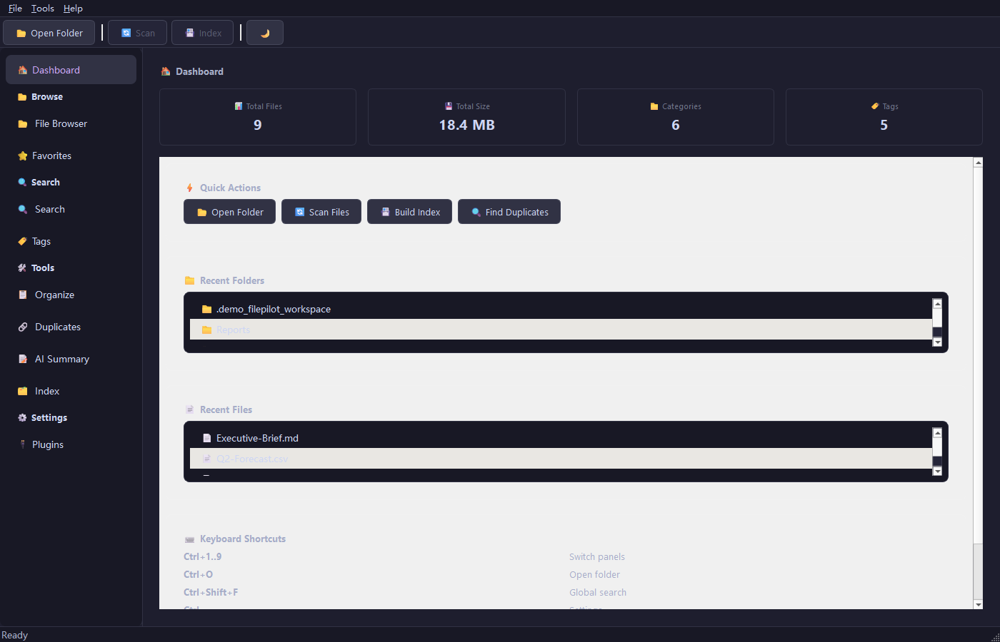 | 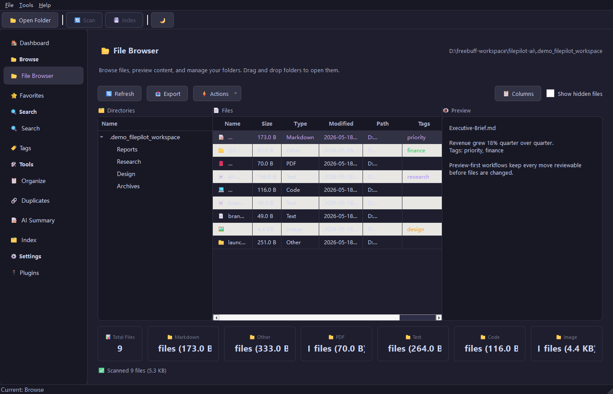 |

| Search | Tags |
| --- | --- |
| 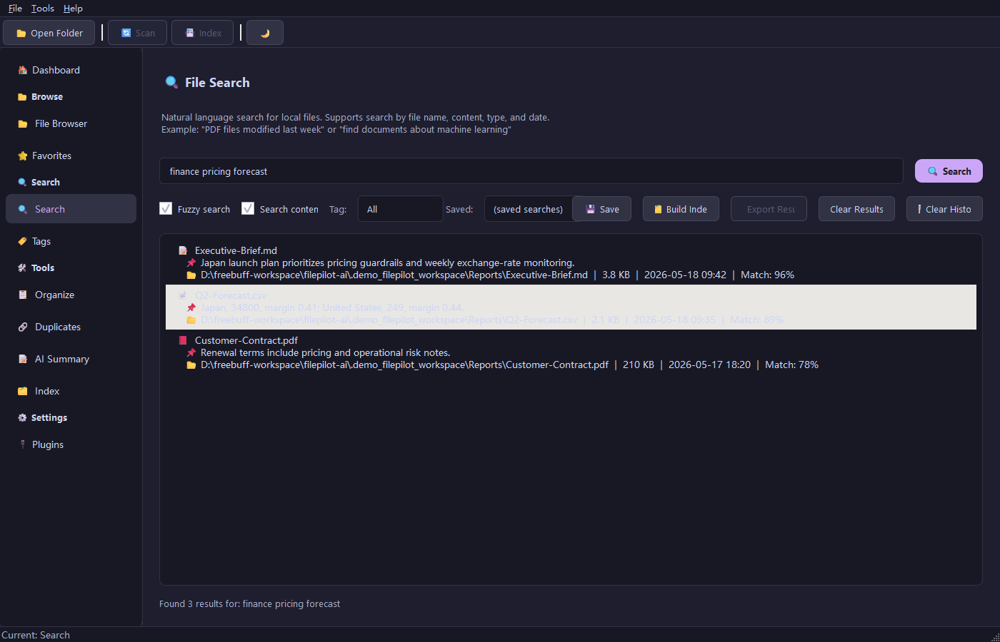 | 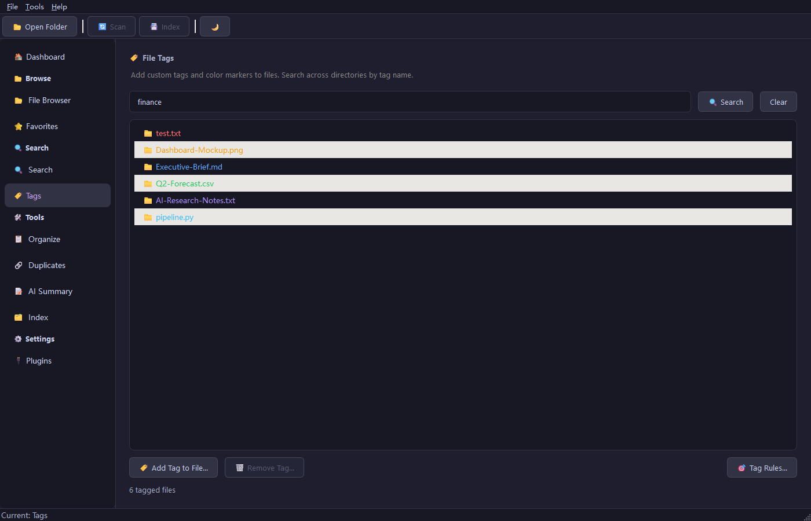 |

| Organize | Duplicates |
| --- | --- |
| 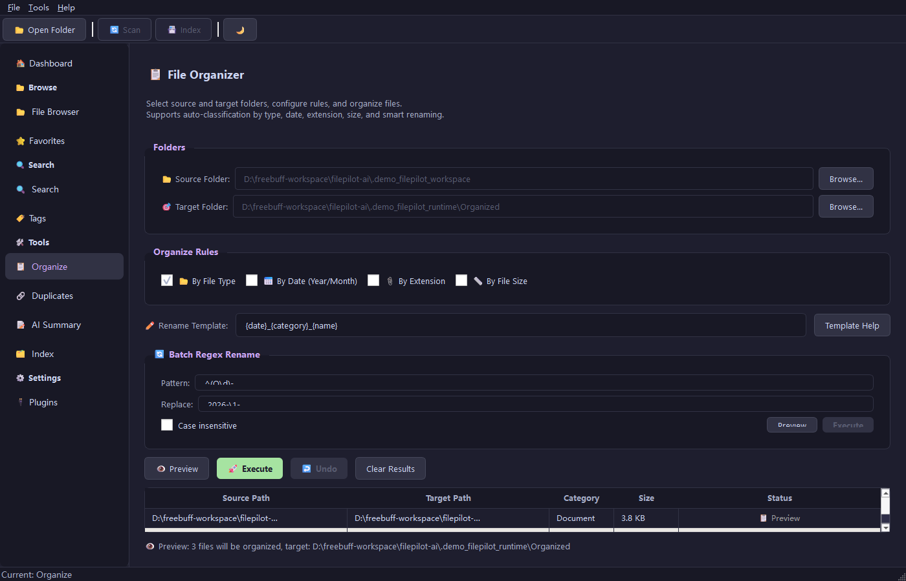 | 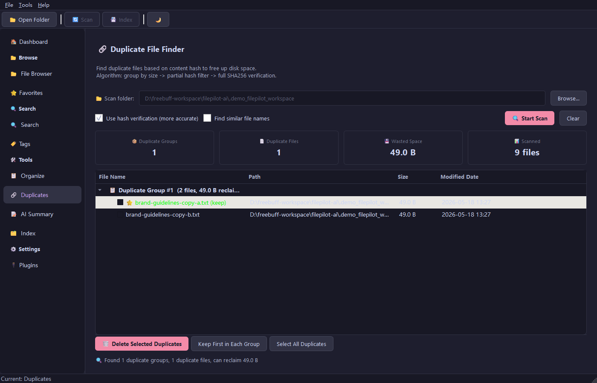 |

| AI Summary | Index |
| --- | --- |
| 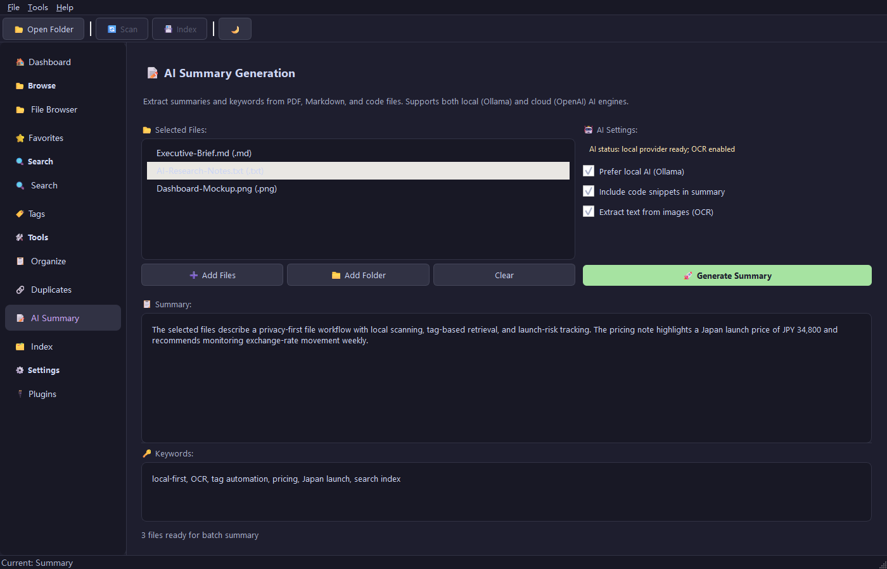 | 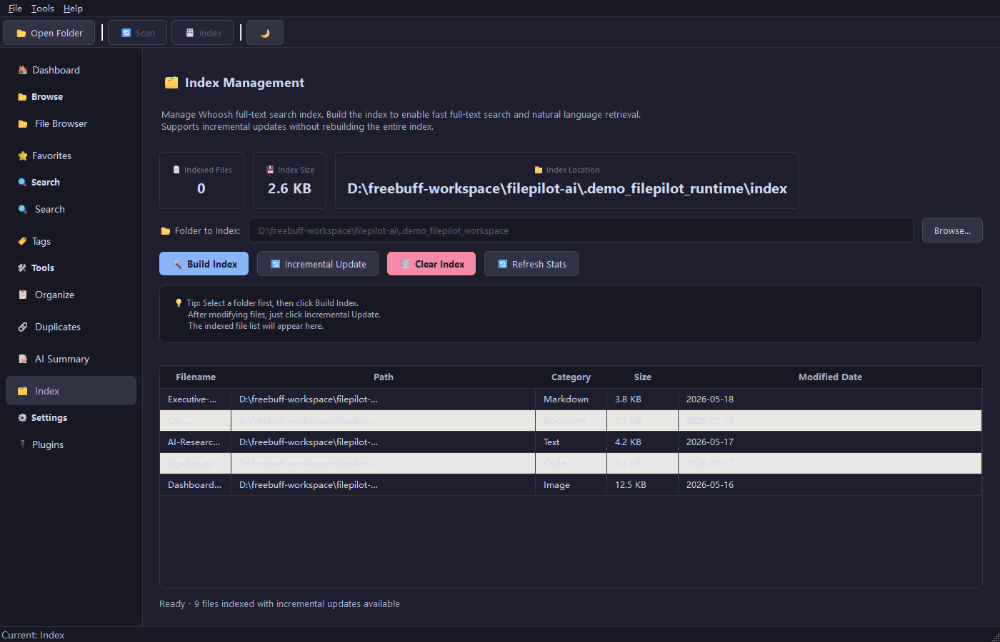 |

| Plugin Manager |
| --- |
| 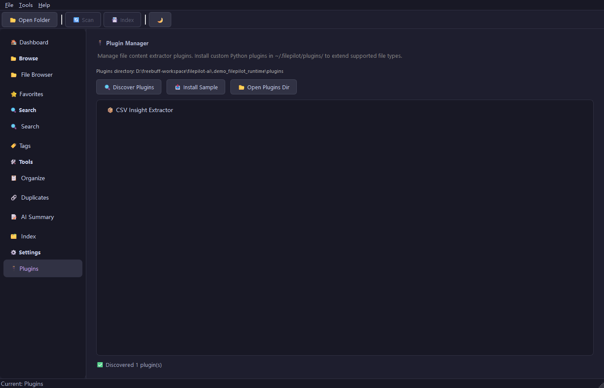 |

## Features

### Search and Indexing

- Whoosh-powered local full-text index.
- Keyword, fuzzy, boolean, tag-filtered, saved, and semantic search.
- Search history, CSV export, and incremental index updates.
- SQLite embedding cache for semantic re-ranking without adding a heavy numeric dependency.

### File Management

- Preview-first file browser with custom columns and archive browsing.
- Batch copy, move, delete, tag, rename, and open-location actions with shared overwrite protection.
- Favorites, recent folders, recent files, global shortcuts, themes, tray support, and notifications.
- 18 built-in UI languages.

### Organization and Cleanup

- Organize files by type, date, extension, or size range.
- Batch rename with templates, regex support, and preview before execution.
- Duplicate detection with size grouping, partial hashing, full SHA-256 verification, and safe deletion through the system recycle bin.
- Undo-log support for organization workflows.

### AI, Chat, OCR, and Extractors

- AI Chat panel for conversational file queries — works without an AI provider for basic searches.
- Optional AI summaries and keyword extraction for PDF, Markdown, code, text, Office files, and images.
- OCR support through Tesseract for image text extraction.
- Local providers: Ollama, llama.cpp, LM Studio, or OpenAI-compatible local endpoints.
- Cloud providers: OpenAI, Anthropic, and custom OpenAI-compatible APIs.
- Plugin system with one-click install from the community registry.

## Quick Start

### Requirements

- Python 3.10 or newer
- Windows, macOS, or Linux
- Optional: Ollama, llama.cpp, LM Studio, or another local AI runtime
- Optional: OpenAI, Anthropic, or any OpenAI-compatible endpoint
- Optional: Tesseract OCR for image text extraction

### Run from Source

```bash
git clone https://github.com/cuiheng511/filepilot-ai.git
cd filepilot-ai

python -m venv .venv

# Windows
.venv\Scripts\activate

# macOS / Linux
source .venv/bin/activate

pip install -r requirements.txt
python -m filepilot.main
```

### Development Setup

```bash
pip install -e ".[test,dev]"
ruff check .
ruff format --check .
mypy
python -m pytest
```

## CLI Examples

```bash
# Scan a folder
python -m filepilot.cli scan ~/Documents

# Search indexed files
python -m filepilot.cli search ~/Documents "machine learning"

# Find duplicate files
python -m filepilot.cli duplicates ~/Downloads

# Export an inventory report
python -m filepilot.cli export ~/Projects --format csv -o report.csv

# Analyze disk usage
python -m filepilot.cli disk-usage ~/

# Preview an organization plan before moving anything
python -m filepilot.cli organize ~/Downloads ~/Sorted --dry-run --rules category date
```

## AI Providers

FilePilot AI supports local and cloud providers through a unified interface. See [docs/AI-PROVIDERS.md](docs/AI-PROVIDERS.md) for setup details, examples, and provider-specific privacy notes.

| Provider | Mode | Default URL |
| --- | --- | --- |
| Ollama | Local | `http://localhost:11434` |
| llama.cpp / vLLM | Local | `http://localhost:8080` |
| LM Studio | Local | `http://localhost:1234` |
| OpenAI | Cloud | `https://api.openai.com/v1` |
| Anthropic | Cloud | `https://api.anthropic.com` |
| Custom endpoint | Cloud or local | User-defined |

Cloud providers only receive content you choose to summarize. Routine scanning, indexing, tagging, searching, duplicate detection, and organization do not require cloud AI.

## Architecture

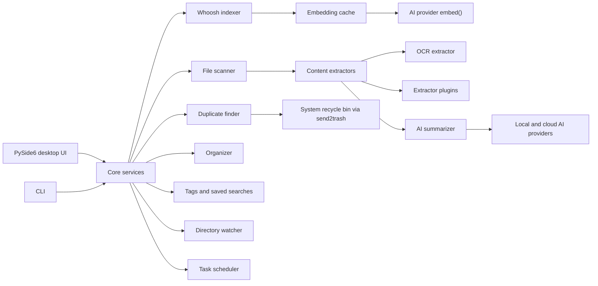

## Project Structure

```text
filepilot-ai/
|-- filepilot/
|   |-- ai/                  # AI providers and summarization
|   |-- core/                # Scanner, indexer, organizer, duplicates, tags, watcher, cloud_sync, file_snapshot, file_operations, plugin_registry
|   |-- extractors/          # PDF, Markdown, code, image, Office, OCR extractors
|   |-- resources/           # Application icons
|   |-- styles/              # Theme manager and QSS themes
|   |-- ui/                  # PySide6 panels and dialogs
|   |-- app.py               # Application bootstrap
|   |-- auto_start.py        # OS startup registration
|   |-- cli.py               # Command-line interface
|   |-- i18n.py              # Translation catalog
|   `-- main.py              # GUI entry point
|-- tests/                   # Unit and UI tests
|-- scripts/                 # Windows, Linux, and macOS build scripts
|-- docs/                    # Build, AI provider, and asset docs
|-- .github/workflows/       # CI pipeline
|-- FilePilot.spec           # Windows PyInstaller build config
|-- pyproject.toml           # Package metadata and tooling
`-- requirements.txt         # Runtime dependencies
```

## Build Installers

For full build instructions, see [docs/BUILD.md](docs/BUILD.md).

| Platform | Output |
| --- | --- |
| Windows | `dist/FilePilot/` and `dist/FilePilot-AI-Setup-*.exe` |
| Linux | `FilePilot-AI-*.AppImage` |
| macOS | `FilePilot AI.app` and `FilePilot-AI-*.dmg` |

Release assets should be shipped with matching `.sha256` files. CI runs `scripts/verify_release_assets.py` after checksum generation so updater downloads and release uploads use the same integrity contract.

## Security and Privacy

| Area | Design |
| --- | --- |
| Local-first workflow | File scanning, indexing, duplicate detection, tags, and organization run locally. |
| Optional AI | Summarization can use local models or explicitly configured cloud providers. |
| API keys | Stored with OS keyring when available, with encrypted fallback storage. |
| Safe deletion | Duplicate cleanup uses the system recycle bin through `send2trash`. |
| Safe file actions | Batch copy and move operations share one previewable service that auto-renames conflicting destinations instead of overwriting them. |
| Plugin installs | Registry plugin names are constrained to safe filenames, remote registry entries require SHA-256 pins, and installs require user confirmation before code is written locally. |
| Update integrity | Release downloads are checked against their `.sha256` sidecar before installation; CI verifies generated release sidecars before upload. |
| Telemetry | No analytics, tracking, or background phone-home behavior. |

### Security Model

FilePilot treats local files as private user data and keeps ordinary browsing, scanning, indexing, tags, duplicate detection, and organization on the local machine. Optional cloud AI calls are explicit feature actions and use the provider settings you configure.

Community plugins are trusted code only after user approval. The registry installer rejects unsafe plugin names, keeps plugin files inside the local plugin directory, requires SHA-256 pins for remote registry entries, and warns before installing remote Python code. A malicious plugin can still do what local Python code can do after installation, so only install plugins from sources you trust.

Auto-update downloads require a matching `.sha256` sidecar from the release assets before the installer can be launched. CI also verifies the sidecar against the packaged artifact. This protects against corrupted or mismatched downloads; signed installers and platform trust checks should still be used for release publishing.

## Quality Gates

```bash
ruff check .
ruff format --check .
mypy
python -m pytest
```

The CI pipeline runs linting, type checking, tests, coverage upload, and packaged builds for Windows, Linux, and macOS.

## Contributing

Contributions are welcome. Please read [CONTRIBUTING.md](CONTRIBUTING.md), keep changes focused, and include tests for behavior changes.

## License

FilePilot AI is released under the [MIT License](LICENSE).
