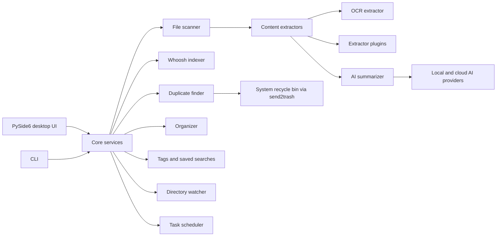

<div align="center">


# FilePilot AI

**A local-first AI file manager for searching, organizing, deduplicating, summarizing, tagging, and indexing your files.**

[](https://python.org)
[](https://pypi.org/project/PySide6/)
[](https://whoosh.readthedocs.io/)
[](#security-and-privacy)
[](LICENSE)

Version 0.6.1

</div>

---

## Overview

FilePilot AI is a desktop file manager built for people who need to understand large local folders before they move, delete, rename, or summarize anything.

It combines recursive scanning, preview-first organization, duplicate detection, full-text indexing, file tags, saved searches, OCR, and optional AI summaries in one PySide6 application. Core file operations stay local by default. Cloud AI providers are only used when you explicitly configure and run AI summarization.

## Demo

<div align="center">


</div>

## What's New in 0.6.1

| Feature | Description |
|---------|-------------|
| **Type Annotation Cleanup** | 17 `annotation-unchecked` mypy warnings resolved across 8 source files. Remaining 4 are pre-existing PySide6 stub notes (not fixable in application code). |
| **Testing Expansion** | 7 new test files: event_bus, app_state, tag_rules, notification, directory_tree, tags_panel, plugin_manager_panel. Total: **704 passing tests** across 40+ test files. |
| **Search Batch Operations** | Right-click context menu on search results with multi-select (ExtendedSelection). Batch delete (send2trash), move (shutil.move), copy (shutil.copy2), tag, and open file location. Undo log for move operations accessible from the same menu. |
| **Auto-Update Download & Install** | `UpdateChecker.download(url, dest, progress_callback)` for streaming downloads with progress; `UpdateChecker.install(path)` launches the platform-specific installer (Windows `/S`, macOS `open`, Linux chmod+exec). New "🔄 Updates" tab in SettingsDialog shows check/download/install flow. |
| **UI Stuck Fixes** | Scan exception now properly restores UI state (file_browser, file_stats_panel, summary_panel). Large-file preview uses streaming reads instead of loading entire file into memory. Division-by-zero guard in batch rename progress calculation. Progress bar now reaches 100% instead of cycling 0–99. |

## Screenshots

| Dashboard | File Browser |
| --- | --- |
|  |  |

| Search | Tags |
| --- | --- |
|  |  |

| Organize | Duplicates |
| --- | --- |
|  |  |

| AI Summary | Index |
| --- | --- |
|  |  |

| Plugin Manager |
| --- |
|  |

## Feature Set

### Desktop Workflow

- Native PySide6 interface with dashboard-first navigation.
- File browser with preview pane, archive browsing, custom columns, and batch copy/move/delete actions.
- Favorites, recent folders, recent files, global search shortcut, customizable shortcuts, light/dark themes, tray support, and toast notifications.
- 18 UI languages through the built-in i18n system.

### Search and Indexing

- Whoosh-powered local full-text index.
- Keyword, fuzzy, and boolean search with content extraction.
- Search history, saved searches, tag filtering, CSV export, and incremental index updates.

### Organization and Cleanup

- Organize by file type, date, extension, or size range.
- Rename templates and batch regex rename with preview before execution.
- Duplicate detection with size grouping, partial-hash filtering, full SHA-256 verification, and safe deletion through the system recycle bin.
- Undo-log support for organization workflows.

### AI, OCR, and Extractors

- AI summaries and keyword extraction for PDF, Markdown, code, text, Office files, and images.
- OCR support through Tesseract for image text extraction.
- Local providers: Ollama, llama.cpp, LM Studio, or OpenAI-compatible local endpoints.
- Cloud providers: OpenAI, Anthropic, and custom OpenAI-compatible APIs.
- Plugin system for custom content extractors.

### Build and Release

- Windows PyInstaller build plus Inno Setup installer.
- Linux AppImage build.
- macOS `.app` and `.dmg` build.
- GitHub Actions pipeline for linting, tests, and three-platform packaging.

## Quick Start

### Requirements

- Python 3.10 or newer
- Windows, macOS, or Linux
- Optional: Ollama, llama.cpp, LM Studio, or another local AI runtime
- Optional: OpenAI, Anthropic, or any OpenAI-compatible cloud endpoint
- Optional: Tesseract OCR for image text extraction

### Run from Source

```bash
git clone https://github.com/cuiheng511/filepilot-ai.git
cd filepilot-ai

python -m venv .venv

# Windows
.venv\Scripts\activate

# macOS / Linux
source .venv/bin/activate

pip install -r requirements.txt
python -m filepilot.main
```

### Development Setup

```bash
pip install -e ".[test,dev]"
ruff check .
ruff format --check .
mypy
pytest
```

## CLI Examples

```bash
# Scan a folder
python -m filepilot.cli scan ~/Documents

# Search indexed files
python -m filepilot.cli search ~/Documents "machine learning"

# Find duplicate files
python -m filepilot.cli duplicates ~/Downloads

# Export an inventory report
python -m filepilot.cli export ~/Projects --format csv -o report.csv

# Analyze disk usage
python -m filepilot.cli disk-usage ~/

# Preview an organization plan before moving anything
python -m filepilot.cli organize ~/Downloads ~/Sorted --dry-run --rules category date
```

## AI Providers

FilePilot AI supports local and cloud AI providers through a unified interface. See [docs/AI-PROVIDERS.md](docs/AI-PROVIDERS.md) for setup details, configuration examples, and provider-specific privacy notes.

| Provider | Mode | Default URL |
| --- | --- | --- |
| Ollama | Local | `http://localhost:11434` |
| llama.cpp / vLLM | Local | `http://localhost:8080` |
| LM Studio | Local | `http://localhost:1234` |
| OpenAI | Cloud | `https://api.openai.com/v1` |
| Anthropic | Cloud | `https://api.anthropic.com` |
| Custom endpoint | Cloud or local | User-defined |

Cloud providers only receive the content you choose to summarize. Scanning, indexing, tags, search, duplicate detection, and organization do not require cloud AI.

## Project Structure

```text
filepilot-ai/
|-- filepilot/
|   |-- ai/                  # AI providers and summarization
|   |-- core/                # Scanner, indexer, organizer, duplicates, tags, watcher, scheduler
|   |-- extractors/          # PDF, Markdown, code, image, Office, OCR extractors
|   |-- resources/           # Application icons
|   |-- styles/              # Theme manager and QSS themes
|   |-- ui/                  # PySide6 panels and dialogs
|   |-- app.py               # Application bootstrap
|   |-- cli.py               # Command-line interface
|   |-- i18n.py              # Translation catalog
|   `-- main.py              # GUI entry point
|-- tests/                   # Unit and UI tests
|-- scripts/                 # Windows, Linux, and macOS build scripts
|-- docs/                    # Build and AI provider guides
|-- .github/workflows/       # CI pipeline
|-- FilePilot.spec           # Windows PyInstaller build config
|-- pyproject.toml           # Package metadata and tooling
`-- requirements.txt         # Runtime dependencies
```

## Architecture



## Build Installers

For full build instructions, see [docs/BUILD.md](docs/BUILD.md).

| Platform | Output |
| --- | --- |
| Windows | `dist/FilePilot/` and `dist/FilePilot-AI-Setup-*.exe` |
| Linux | `FilePilot-AI-*.AppImage` |
| macOS | `FilePilot AI.app` and `FilePilot-AI-*.dmg` |

## Security and Privacy

| Area | Design |
| --- | --- |
| Local-first workflow | File scanning, indexing, duplicate detection, tags, and organization run locally |
| Optional AI | Summarization can use local models or explicit cloud providers |
| API keys | Stored with OS keyring when available, with encrypted fallback storage |
| Safe deletion | Duplicate cleanup uses the system recycle bin through `send2trash` |
| Telemetry | No analytics, tracking, or background phone-home behavior |

## Quality Gates

```bash
ruff check .
ruff format --check .
mypy
pytest
```

The CI pipeline runs linting, tests, coverage upload, and packaged builds for Windows, Linux, and macOS.

## Contributing

Contributions are welcome. Please read [CONTRIBUTING.md](CONTRIBUTING.md), keep changes focused, and include tests for behavior changes.

## License

FilePilot AI is released under the [MIT License](LICENSE).
