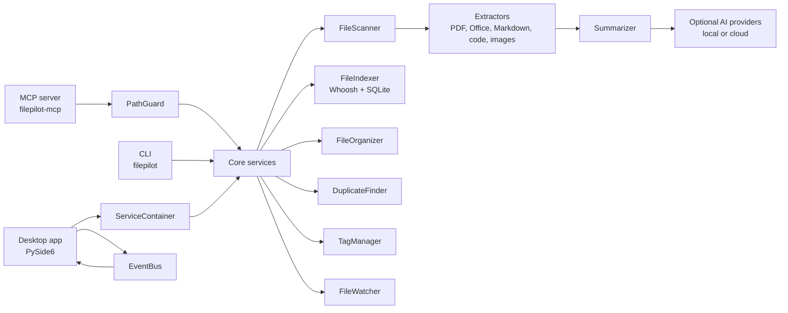

# Architecture

FilePilot AI is organized as a local-first file intelligence stack. The same core
services power the desktop app, command-line workflows, and the MCP server for
AI coding agents.

## Design Goals

- Keep user files local by default.
- Make file reads scoped, bounded, and observable.
- Preview destructive or high-impact actions before they run.
- Share one core implementation across desktop, CLI, and MCP surfaces.
- Let optional AI providers improve summaries and chat without becoming a hard
  requirement for basic file management.

## System Map

## Entry Points

| Entry point | Audience | Responsibility |
| --- | --- | --- |
| `filepilot.main` / `filepilot-gui` | Desktop users | Creates the Qt application, service container, main window, tray, and startup behavior. |
| `filepilot.cli` / `filepilot` | Scripts and terminal users | Runs repeatable scan, search, export, duplicate, and organize workflows. |
| `filepilot.mcp.server` / `filepilot-mcp` | AI coding agents | Exposes scoped local file tools through MCP with explicit safety checks. |

## Core Services

The core layer is intentionally UI-agnostic where possible:

- `FileScanner` walks folders and classifies file metadata.
- `FileIndexer` stores searchable content and metadata using Whoosh plus SQLite.
- `DuplicateFinder` groups exact duplicates with size checks and hashing.
- `FileOrganizer` plans and executes category, date, extension, and size based organization.
- `TagManager` stores user tags and tag metadata.
- `FileWatcher` observes filesystem changes for desktop workflows.
- `Summarizer` wraps local and cloud AI providers, with local extractive fallbacks where useful.

The desktop app wires these services through `ServiceContainer`, which keeps
panels from constructing their own service graph. Panels should accept missing
services gracefully and only request what they need.

## Desktop Data Flow

Desktop panels communicate through explicit services and signals:

1. The user opens a folder in the file browser.
2. The scanner produces file metadata in batches.
3. Panels request shared services from `ServiceContainer`.
4. Cross-panel actions use `EventBus` signals instead of direct imports.
5. Long-running work uses worker objects and Qt thread pools to keep the UI responsive.

This keeps the UI modular enough for incremental refactors while preserving a
single application shell.

## MCP Safety Boundary

The MCP server is deliberately stricter than ordinary local code:

- Every path must resolve inside an allowed root.
- Read tools enforce maximum file size and returned character limits.
- Hidden dot paths are blocked unless explicitly enabled.
- Write-like tools require `--write`.
- Organization changes are saved as dry-run plans before they can be applied.
- Apply and undo operations require `confirm=True` and re-validate paths at execution time.
- Write-like outcomes are recorded in the MCP audit log.

The key rule is that MCP clients never receive broad filesystem authority just
because they can call a tool. The server validates every path and operation at
the tool boundary.

## Storage

| Data | Default location | Notes |
| --- | --- | --- |
| Desktop search index | `~/.filepilot/index` | Whoosh index plus metadata storage. |
| MCP search index | `~/.filepilot/mcp-index` | Separate from the desktop index to keep agent scope explicit. |
| MCP organization plans | `~/.filepilot/mcp-plans` | Saved dry-run plans, applied results, and undo metadata. |
| MCP audit log | `~/.filepilot/mcp-audit.jsonl` | JSONL records for write-like MCP operations. |
| Embedding cache | `~/.filepilot/embeddings.json` | Optional semantic search cache. |

## Testing Strategy

The test suite favors focused unit tests and lower-risk widget tests:

- Pure core modules are tested directly.
- Desktop entry points are tested with mocks instead of launching a real app.
- Qt widgets use `pytest-qt` where interaction matters.
- MCP tools are tested at the tool layer, with a smoke test for server registration.
- CI runs Python 3.10 through 3.13 on Linux and Windows, plus packaging jobs for Windows, Linux, and macOS.

Coverage has a baseline threshold so future changes do not quietly reduce test
coverage while the project continues raising coverage in practical increments.

## Extension Points

- Extractor plugins can add support for new file types.
- AI providers can be configured for local or cloud summarization and chat.
- MCP clients can integrate FilePilot with coding agents while preserving local-first constraints.
- CLI commands provide a stable automation surface for scripts and release checks.

## Architecture Principles

- Prefer preview-first flows for file movement and cleanup.
- Keep UI panels thin around shared services.
- Keep agent-facing tools conservative and auditable.
- Use structured parsers and extractors rather than ad hoc string handling where possible.
- Improve coverage near high-risk boundaries: file operations, MCP safety, startup, and release workflows.
