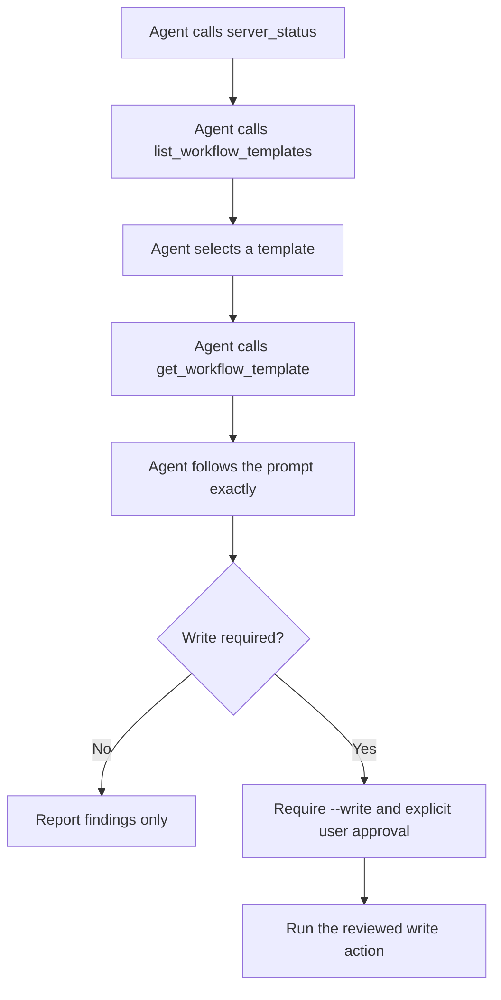

# MCP Workflow Templates

FilePilot MCP includes built-in workflow templates so agents can ask the server
how to behave before they touch local files. The templates are intentionally
plain text and conservative: read-only first, dry-run before write, and explicit
confirmation before any file move.

## Template Tools

| Tool | Purpose |
| --- | --- |
| `list_workflow_templates` | Lists available workflow templates with mode, write requirement, and tool sequence. |
| `get_workflow_template` | Returns the full prompt for one workflow template. |
| `mcp_client_config` | Generates client JSON from the current allowed roots. |

These tools do not read or modify user files. They help an agent discover the
safe operating procedure for the current MCP session.

## Available Templates

| Template ID | Mode | Write required | Best for |
| --- | --- | --- | --- |
| `safe_inventory` | read-only | No | Mapping a folder and summarizing file groups. |
| `document_brief` | read-only | No | Finding and summarizing local documents. |
| `duplicate_review` | read-only | No | Grouping duplicates without deleting anything. |
| `organization_plan` | read-only-first | No | Creating a saved dry-run organization plan. |
| `apply_reviewed_plan` | write-after-review | Yes | Applying one explicitly approved saved plan. |
| `plan_metadata_cleanup` | dry-run-first | Yes | Previewing and removing stale FilePilot plan metadata. |

## Agent Flow



## Example: Read-Only Inventory

```text
Use FilePilot MCP in read-only mode. First call server_status and confirm the
allowed roots. Then scan the target folder with scan_files, summarize file counts
by category and extension, and call out large or unusual files. Do not move, tag,
or delete anything.
```

## Example: Organization Plan

```text
Use FilePilot MCP to create a dry-run organization plan only. Confirm both source
and target roots are allowed, call propose_organization_plan, then show the
plan_id, operation count, sample moves, and risks. Do not apply the plan unless
the user later starts a trusted write-mode session and explicitly approves
confirm=true.
```

## Client Config Helper

After starting the server with allowed roots, an agent can call:

```text
mcp_client_config(client="cursor")
```

The result contains JSON shaped like:

```json
{
  "mcpServers": {
    "filepilot": {
      "command": "filepilot-mcp",
      "args": ["--allow", "/Users/you/Documents", "--read-only"]
    }
  }
}
```

Use `include_write=true` only for temporary trusted sessions where the user has
already reviewed a saved plan or explicitly wants tag metadata written.
