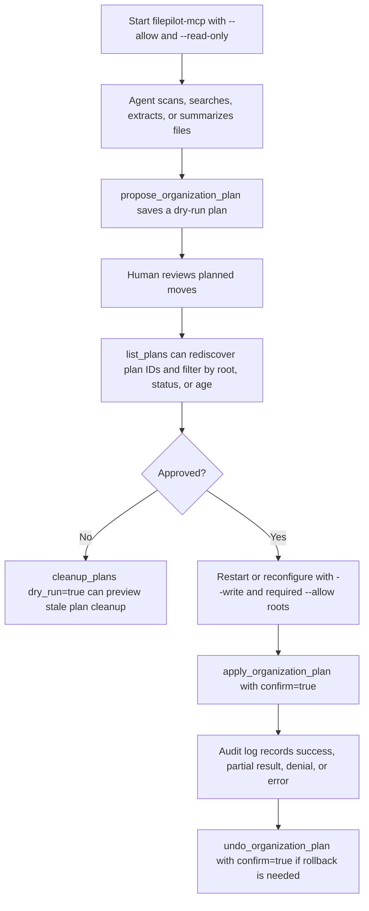

# FilePilot MCP Server

FilePilot MCP exposes FilePilot AI's local-first file tools to MCP clients such as Claude Code, Codex, Cursor, and other agent runtimes.

The server is designed to be conservative by default:

- It can only access directories passed with `--allow`.
- It starts in read-only mode.
- Hidden dot paths are blocked unless `--allow-hidden` is set.
- File reads are bounded by file size and returned characters.
- Organization starts as a dry-run plan and can only be applied with `--write` plus `confirm=True`.

## Install

From a source checkout:

```bash
pip install -e ".[mcp]"
```

From a package install:

```bash
pip install "filepilot-ai[mcp]"
```

The MCP extra is intended for agent workflows. Desktop UI installs should use the normal requirements file or install the `desktop` extra as well.

## Start The Server

Allow one directory:

```bash
filepilot-mcp --allow ~/Documents --read-only
```

Allow multiple directories:

```bash
filepilot-mcp --allow ~/Documents --allow ~/Downloads --read-only
```

Enable write-like tools such as `add_tags`, `apply_organization_plan`, and `undo_organization_plan`:

```bash
filepilot-mcp --allow ~/Documents --allow ~/Sorted --write
```

Tune read limits:

```bash
filepilot-mcp --allow ~/Documents --max-file-mb 25 --max-read-chars 20000
```

Choose a custom audit log location:

```bash
filepilot-mcp --allow ~/Documents --write --audit-log ~/.filepilot/mcp-audit.jsonl
```

Force read-only mode even when an environment variable enables writes:

```bash
filepilot-mcp --allow ~/Documents --read-only
```

## Environment Variables

| Variable | Purpose | Default |
| --- | --- | --- |
| `FILEPILOT_MCP_ALLOWED_DIRS` | Allowed directories, separated by the platform path separator. | Empty |
| `FILEPILOT_MCP_WRITE_ENABLED` | Set to `1`, `true`, `yes`, or `on` to allow write-like tools. | Disabled |
| `FILEPILOT_MCP_ALLOW_HIDDEN` | Set to `1`, `true`, `yes`, or `on` to allow dot-prefixed hidden paths. | Disabled |
| `FILEPILOT_MCP_MAX_FILE_MB` | Maximum readable file size in MB. | `50` |
| `FILEPILOT_MCP_MAX_READ_CHARS` | Maximum characters returned by read/extract tools. | `40000` |
| `FILEPILOT_MCP_INDEX_DIR` | Index directory used by MCP search tools. | `~/.filepilot/mcp-index` |
| `FILEPILOT_MCP_PLAN_DIR` | Directory for saved organization plans. | `~/.filepilot/mcp-plans` |
| `FILEPILOT_MCP_AUDIT_LOG` | JSONL audit log for MCP write operations. | `~/.filepilot/mcp-audit.jsonl` |

Command-line flags override defaults and are the recommended way to configure clients. Use `--read-only` for agent sessions where you want an explicit guardrail that overrides `FILEPILOT_MCP_WRITE_ENABLED`.

## Client Configuration

Most MCP clients accept a command and args list. Use one of these patterns and place it wherever your client stores MCP server configuration.

For client-specific snippets, see [MCP-CLIENTS.md](MCP-CLIENTS.md).

### Installed Package

Use this after `pip install "filepilot-ai[mcp]"` or `pip install -e ".[mcp]"`:

```json
{
  "mcpServers": {
    "filepilot": {
      "command": "filepilot-mcp",
      "args": ["--allow", "C:\\Users\\you\\Documents", "--read-only"]
    }
  }
}
```

### Source Checkout

Use Python directly if the console script is not on `PATH`:

```json
{
  "mcpServers": {
    "filepilot": {
      "command": "python",
      "args": [
        "-m",
        "filepilot.mcp.server",
        "--allow",
        "C:\\Users\\you\\Documents",
        "--read-only"
      ]
    }
  }
}
```

### Multiple Roots

Repeat `--allow` for every directory the agent may inspect:

```json
{
  "mcpServers": {
    "filepilot": {
      "command": "filepilot-mcp",
      "args": [
        "--allow",
        "C:\\Users\\you\\Documents",
        "--allow",
        "C:\\Users\\you\\Downloads",
        "--read-only"
      ]
    }
  }
}
```

### Read-Only Recommended

Keep the default read-only mode for Claude Code, Codex, Cursor, and other coding agents unless you specifically need FilePilot to write tag metadata or apply a reviewed organization plan.

`--read-only` is optional because read-only is already the default, but it is useful in shared configs where `FILEPILOT_MCP_WRITE_ENABLED` may be set by the shell or CI environment.

## Tools

| Tool | Description | Write mode required |
| --- | --- | --- |
| `server_status` | Shows allowed directories, limits, write mode, and index location. | No |
| `list_workflow_templates` | Lists safe agent workflow templates and required tools. | No |
| `get_workflow_template` | Returns one workflow template with a full prompt. | No |
| `mcp_client_config` | Generates client JSON from the current allowed roots. | No |
| `scan_files` | Returns metadata for files under an allowed directory. | No |
| `search_files` | Searches file names and relative paths without building an index. | No |
| `index_folder` | Builds or updates a local FilePilot MCP index. | No |
| `search_index` | Searches the MCP index, optionally scoped to a root. | No |
| `read_file` | Reads a bounded text slice from a file. | No |
| `extract_file_text` | Extracts text from supported documents and code files. | No |
| `summarize_file` | Summarizes extracted text with configured AI or a local fallback. | No |
| `suggest_tags` | Suggests tags without writing metadata. | No |
| `add_tags` | Adds FilePilot tag metadata. | Yes |
| `find_duplicates` | Finds exact duplicate files under an allowed directory. | No |
| `propose_organization_plan` | Creates and saves a dry-run organization plan. | No |
| `list_plans` | Lists saved organization plans, with optional root, status, and age filters. | No |
| `cleanup_plans` | Finds or removes expired saved organization plan metadata. Defaults to dry-run. | Delete requires write mode |
| `apply_organization_plan` | Applies a saved organization plan after re-validating source and destination paths. | Yes |
| `undo_organization_plan` | Restores successful moves from an applied organization plan. | Yes |

## MCP Organization Workflow



## Built-In Workflow Templates

Agents can call `list_workflow_templates` to discover safe operating patterns
and `get_workflow_template` to retrieve the full prompt for one workflow.
Templates cover read-only inventory, document briefs, duplicate review,
dry-run organization plans, applying reviewed plans, and stale plan metadata
cleanup.

`mcp_client_config` returns copy-paste-ready MCP client JSON using the current
allowed roots, so agents can help users move from a working server session to a
persistent Claude Desktop, Claude Code, Cursor, Codex, or generic MCP config.

See [MCP-WORKFLOWS.md](MCP-WORKFLOWS.md) for the full template list and examples.

## Safety Notes

### Directory Scope

Every path is resolved before use and must be inside one of the configured allowed directories. Attempts to access sibling directories, parent directories, or unrelated absolute paths are rejected.

### Read Limits

`read_file` and `extract_file_text` enforce the configured maximum file size and returned character count. Agents receive a slice of content plus metadata showing whether the result was truncated.

### Writes

Write-like tools are disabled unless the server starts with `--write`. `add_tags` writes FilePilot tag metadata. `apply_organization_plan` can move files, but only from a saved plan and only when the client passes `confirm=True`. `undo_organization_plan` can restore successful moves from an applied plan and also requires `confirm=True`.

Saved organization plans are not trusted blindly. `list_plans` lets an agent rediscover plan IDs and see whether plans are still proposed, already applied, or undone. It can filter by `root`, `status` (`proposed`, `applied`, or `undone`), and `max_age_days` so agents can focus on one workspace or show stale plans.

Before moving each file, FilePilot resolves and re-validates the source and destination against the current allowlist, checks that the source still exists, and refuses to overwrite an existing destination. If a later operation fails, successful and failed per-file results are saved back to the plan so `undo_organization_plan` can still restore successful moves.

Organization plans include target slots such as `D001` and `D002` for destination directories. `propose_organization_plan` returns the full slot list, and `list_plans` includes a compact slot summary so agents can ask about a slot without repeating long filesystem paths. FilePilot still applies the exact saved paths after validation.

`apply_organization_plan` refuses to apply a plan that already has `applied_at`, so repeated agent calls cannot accidentally run the same saved move plan twice.

`cleanup_plans` only removes saved plan metadata, not user files. It defaults to `dry_run=True`; actual deletion requires `dry_run=False` and write mode. Use this for old proposed/applied/undone plans after reviewing the returned candidates.

### Audit Log

When the server is launched normally, write-like MCP operations are recorded as JSONL in `~/.filepilot/mcp-audit.jsonl` or the path supplied with `--audit-log`. Records include a UTC timestamp, tool name, status, path, operation details, and error text when applicable. Denied writes are logged too, which helps review accidental or over-broad agent requests.

### Index Scope

The MCP server stores its own index under `~/.filepilot/mcp-index` by default. `search_index` filters results back through the current allowed directories, so stale results outside the current MCP scope are not returned.

## Review Checklist

Use this checklist when reviewing MCP changes:

- Paths are resolved before access and must remain inside an allowed root.
- Hidden paths stay blocked unless hidden access is explicitly enabled.
- Read tools respect `max_file_size_bytes` and `max_read_chars`.
- Indexed search results are filtered through the current allowlist before being returned.
- Write-like tools call `resolve_write_path` and fail when `--write` is not set.
- Write-like tools record success, denial, or error in the MCP audit log.
- Organization apply and undo require a saved plan ID, `confirm=True`, write mode, and current allowlist validation.
- Saved organization plans are discoverable through `list_plans`, can be filtered by root/status/age, and already applied plans cannot be applied a second time.
- Old saved plan metadata can be previewed with `cleanup_plans(dry_run=True)` before deletion.
- Workflow templates are informational only; they do not read or mutate files.
- New MCP tools have tests for allowed, denied, and bounded behavior.

## Suggested Agent Prompts

```text
Use FilePilot in read-only mode to scan my Downloads folder, list the largest file groups by extension, and point out anything that looks safe to archive. Do not move or tag files.
```

```text
Use FilePilot to index my Documents folder, then search for PDFs about taxes from 2025. For the top matches, extract a bounded text sample and summarize what each file appears to contain.
```

```text
Use FilePilot to find exact duplicates under my Photos export folder. Group them by duplicate set, show the paths, and do not delete anything.
```

```text
Use FilePilot to propose an organization plan for my Screenshots folder into my Sorted folder by extension and date. Save the plan, show me the operations, and do not apply it until I explicitly approve.
```

```text
Use FilePilot to list saved organization plans for my Downloads folder. Show only proposed plans older than 14 days and explain whether cleanup_plans would remove them in dry-run mode.
```

```text
After I approve the plan ID, restart FilePilot MCP with write mode if needed, verify both source and target folders are allowed, and apply the plan with confirm=true.
```

## Troubleshooting

| Symptom | Fix |
| --- | --- |
| `The MCP SDK is not installed` | Install with `pip install "filepilot-ai[mcp]"` or `pip install -e ".[mcp]"`. |
| `No allowed directories configured` | Add at least one `--allow <directory>` argument. |
| `Path is outside allowed directories` | Pass a path inside one of the allowed roots or add another allowed root. |
| Hidden path rejected | Restart with `--allow-hidden` if you intentionally need dot-prefixed paths. |
| Index search returns nothing | Run `index_folder` on an allowed directory first. |
| Plan apply or undo rejected | Start with `--write`, include both source and target roots in `--allow`, and pass `confirm=true` from the client. |
| Old plan files keep appearing | Call `cleanup_plans(max_age_days=30, dry_run=true)` first, then repeat with `dry_run=false` in write mode after reviewing the candidates. |

## Roadmap

| Milestone | Notes |
| --- | --- |
| End-to-end client smoke tests | Exercise a real MCP client/server call path beyond tool registration. |
| Workflow transcripts | Add examples showing agents using built-in templates correctly. |
| Audit log views | Make plan and write-action audit review easier for desktop users. |
